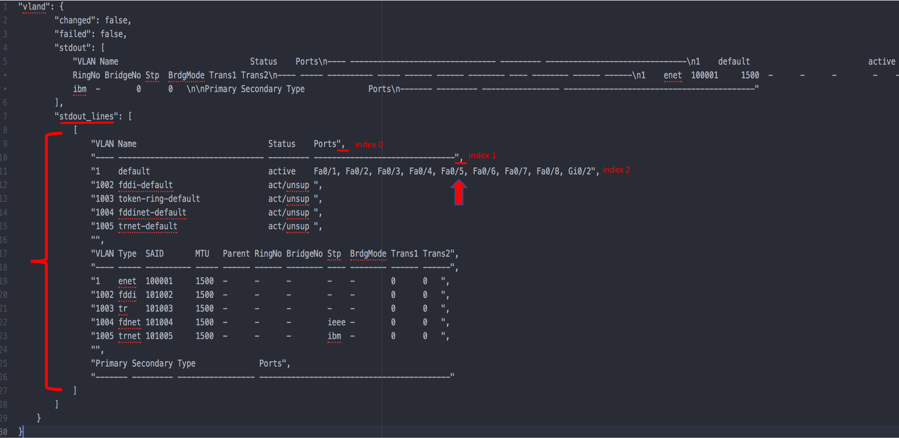

Debug1
=======

If we print (*debug*) our registed variable *'vland'* we see...a bunch of garbage

    Fig 3

However, from this mess we can see what we want. In Python a list is denoted by '[ ]', and at *stdout_lines* we see the start of a list `[` followed by another list `[`.  This means we have a list of lists and all lists have indexes.

:: 

   Example: List

   list = ["a", "b", "c"]
   print(list[0])
   >>> a

   Example: List of Lists
   list1 = ["a", "b", "c"]
   list2 = ["d", "e", "f"]
   combined = [list1, list2]
   print(combined[0][0])
   >>> a

