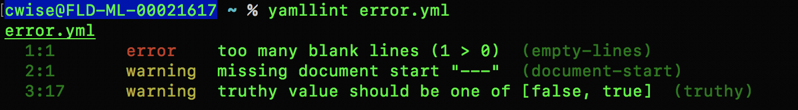

Linting
=======

.. centered:: *"the process of running a program that will analyze code for potential errors"*

::

    yamllint <filename>.yml

In our example files:

.. literalinclude:: ../../error.yml
   :linenos:
   :caption: error.yml
   :language: yaml

.. literalinclude:: ../../noerror.yml
   :linenos:
   :caption: noerror.yml
   :language: yaml

.. code-block:: bash
   :caption: yamllint

   yamllint error.yml
   yamllint noerror.yml

.. centered:: Fig 4

Configurations of yamllint

Depending on your OS

Container
 - ``ls /usr/lib/python3.7/site-packages/yamllint/conf``

pip3 on Ubuntu
 - ``ls /usr/lib/python3/dist-packages/yamllint/conf``

pip3 on Mac (homebrew)
 - ``ls /usr/local/lib/python3.7/site-packages/yamllint/conf``

You will see two files, default and relaxed.  These come included during installation but you can always make your own, Happy `Googling <https://buildmedia.readthedocs.org/media/pdf/yamllint/stable/yamllint.pdf>`_

.. code-block:: yaml
   :linenos:
   :caption: default.yaml

    ---
    rules:
      braces: enable
      brackets: enable
      colons: enable
      commas: enable
      comments:
        level: warning
      comments-indentation:
        level: warning
      document-end: disable
      document-start:
        level: warning
      empty-lines: enable
      empty-values: enable
      hyphens: enable
      indentation: enable
      key-duplicates: enable
      key-ordering: disable
      line-length: enable
      new-line-at-end-of-file: enable
      new-lines: enable
      octal-values: enable
      quoted-strings: disable
      trailing-spaces: enable
      truthy:
        level: warning

One more "linting" item to cover before we look into plays/playbooks.  We can use Ansible to find other issues that are more Ansible related
::

    ansible-playbook error.yml --syntax-check

Or you can install ``ansible-lint``

::

    pip3 install ansible-lint --user