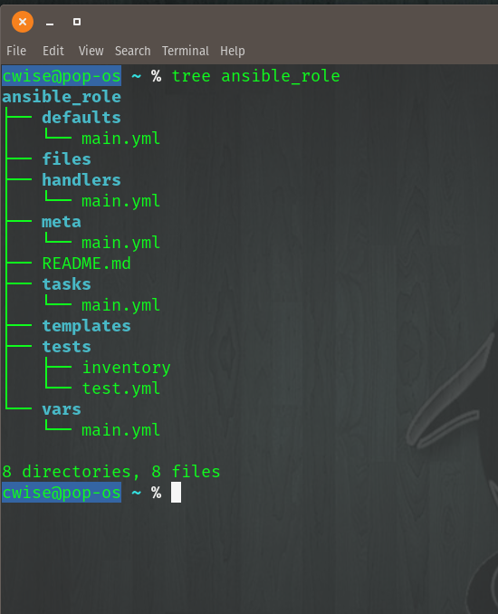

Roles
======

Definintion:

Let's use Ansible Galaxy to build our file structure for our role ``ansible_role``

::

    ansible-galaxy init ansible_role

.. figure:: imgs/galaxy_init.png
   :scale: 60%
   :align: center
.. centered:: Fig 8

Ansible Galaxy has now made our directory ``ansible_role`` and the complete folder structure as shown below

.. centered:: Fig 9

Folder breakdown
^^^^^^^^^^^^^^

Tasks
 * main.yml - this is file will contain our plays; this serves as the same ``tasks`` section of our playbook

Vars
 * main.yml -

Handlers
 * main.yml

 Meta
  * main.yml