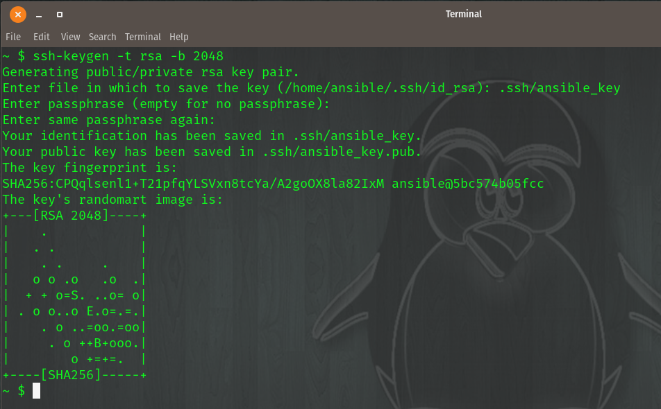
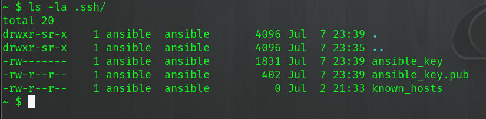

SSH Key Generation
===================

Create Public and Private key pair::

From a terminal screen you can generate a ssh key of type (-t) rsa and length (-b) 2048.

.. code-block:: bash
   :caption: Create SSH Key
   
   ssh-keygen -t rsa -b 2048

This will prompt the below, note the file name to save to ``.ssh/ansible_key`` No passphrase is needed, just hit *Enter*

::

    Generating public/private rsa key pair.
    Enter file in which to save the key (/home/ansible/.ssh/id_rsa): .ssh/ansible_key
    Enter passphrase (empty for no passphrase): 
    Enter same passphrase again: 

.. centered:: Fig 1

The above command would produce two files:

 - ansible_key
 - ansible_key.pub

Let's validate our files exist

.. code-block:: bash
   :caption: List files

   ls -la .ssh/

.. centered:: Fig 2
