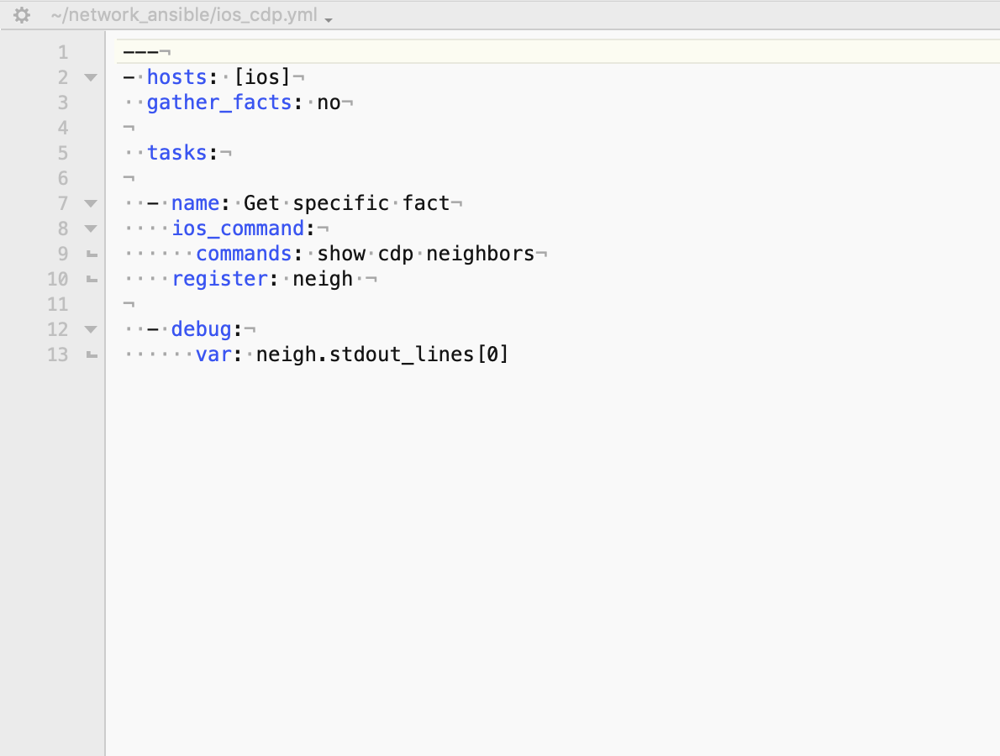

YAML
======

YAML or YML (it has too many meanings: Yet Another Markup Language; Yaml Ain't Markup Language) who cares?

It's easy to read!

.. code-block:: yaml
   :linenos:
   :caption: Example YAML
   :emphasize-lines: 6

    ---
    - hosts: <individual host> or [group of hosts]
      gather_facts: false

      vars_files:

      tasks:

      - name: task name 1
        module:
          module_command:

      - name: task name 2
        module:
          module_command:

The three  ``---``  dashes indicate the start of a YML file.  Then comes the playbook definitions based on indention's much like that of Python. **Please look** at Figure 3 below to take note of how everything lines up.

.. centered:: Fig 3

We declare what hosts we want to work with or group of hosts based on a inventory file, we can also make an external variable sheet to reference to run our play against. Example, we want to declare how a vlan, a route or a virtual server are built and only allow individuals to pass variables to the play standardizing how we build.

Next comes the tasks, these are the individual plays to be run from our playbook.
