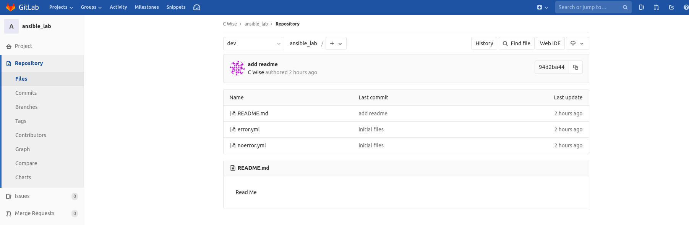

Branch 
~~~~~~~

Let's first take a definition straight from git [#]_ itself

::

    "Branching means you diverge from the main line of development and continue to do work without messing with that main line."

What does this mean to a NetOps person.  We aren't building applications, but we are enabling them.  As a NetOps person we can use Git to track network infrastructure configurations and catch unwanted drift.
We can define how Vlans, routes or any simple task gets built.  By building our Ansible playbook in Git, we can version control it, even allow others to contribute (in a feature branch) in which we decide to allow the new additions or reject them.  It even allows 
users to file issues they've expericed and use to fix those.

..  centered::  Commands we will use for Branch

::

    git branch                      { show the working branch }
    git checkout <branch name>      { command to switch our working branch }
    git checkout -b <new branch>    { creates a new branch }
    git checkout -d <branch name>   { deletes branch name }

From module 1 we created our master branch (default branch), let's verify that using:
::

    git branch
.. important:: **DO NOT MAKE CHANGES IN THE MASTER BRANCH, HARD LESSON LEARNED HERE**

Now we will create a new branch *'dev'*, this is where we will make our changes and merge them back into the mainline *Master*

::

    git checkout -b dev 

This will create a branch locally, We'll now add a README.md to our *dev* branch.

.. sidebar::  Linux Cheat Sheet

    | i     { for insert }
    | esc   { to exit for saving }
    | :wq   { write & quit }

::

    vi README.md

And now insert some text

::

    This is a readme file

Once that file is created and saved, let's set our up-stream dev branch and commit our file
::

    git push --set-upstream git@gitlab.com:<username>/ansible_lab.git dev

Now we can verify our new file and branch are present from out Gitlab page

.. centered:: Fig 1
   
.. rubric:: Footnotes
..  [#] https://git-scm.com/book/en/v2/Git-Branching-Branches-in-a-Nutshell