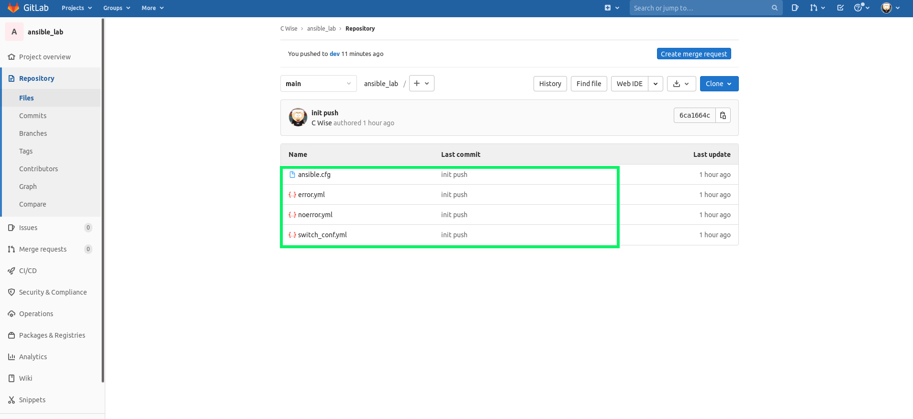
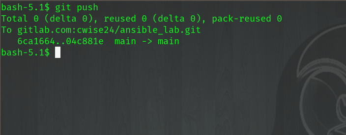
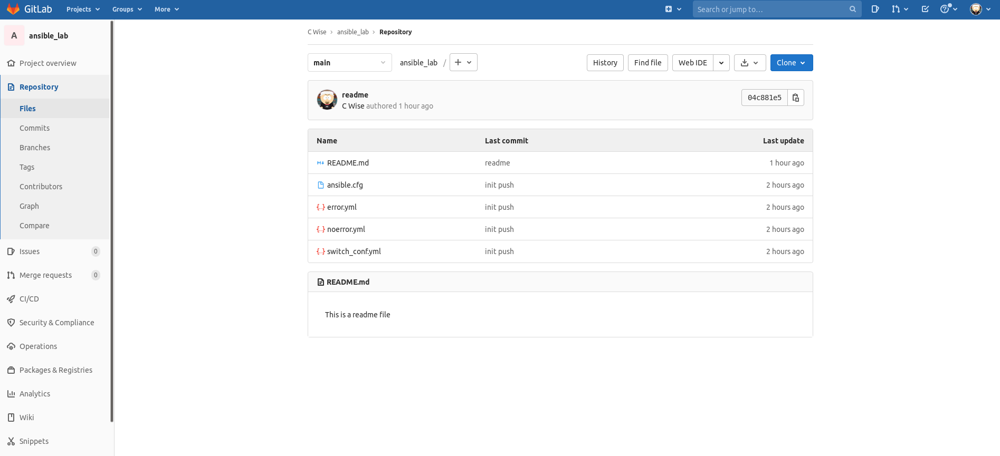
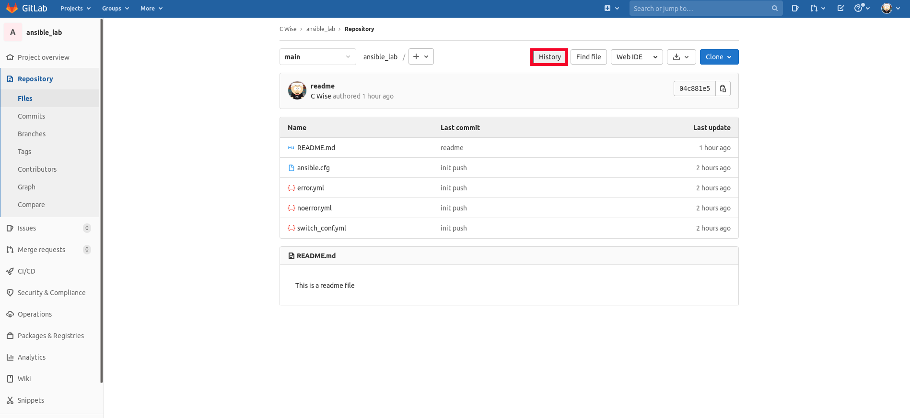

Merge
~~~~~~

Let's now view our *Main* branch on Gitlab, notice our new file *README.md* is not there

.. centered:: Fig 1

We can validate what branch we are on, you should see the asterisk on the *dev* branch
::

    git branch

    * dev
      main

Now using the *checkout* command, switch back to the *main* branch
::

    git checkout main

.. image:: imgs/checkout_m.png
   :scale: 60%
   :align: center
.. centered:: Fig 2

Now we call the branch we want to merge into our current working branch.  We will merge dev into main.
::

    git merge dev

.. image:: imgs/merge_d.png
   :scale: 60%
   :align: center
.. centered:: Fig 3

Remember, this is only a merge locally, you must still push these changes to the remote repository at Gitlab
::

    git push

.. centered:: Fig 4

Flipping back over to our Gitlab site

.. centered:: Fig 5

From here we can click on History to view commits that have been made

.. centered:: Fig 6