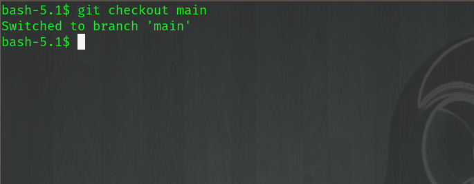
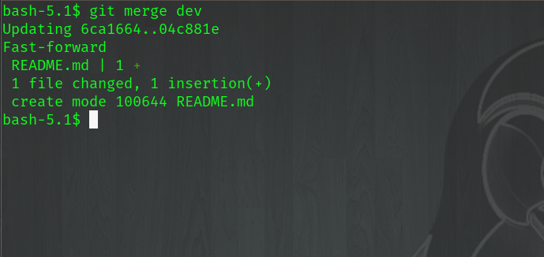

Merge
~~~~~~

Let's now view our *Master* branch on Gitlab, notice our new file README.md is not there

.. centered:: Fig 2

We can validate what branch we are on, you should see the asterisk on the *dev* branch
::

    git branch

    *dev
      master

Now using the *checkout* command, switch back to the *master* branch
::

    git checkout master

.. centered:: Fig 3

Now we call the branch we want to merge into our current working branch.  We will merge dev into master.
::

    git merge dev

.. centered:: Fig 4