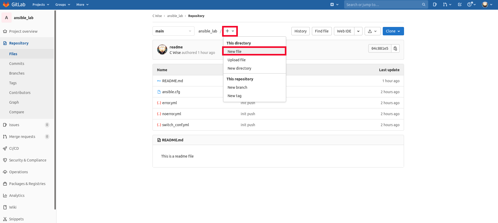

Fetch and Pull
~~~~~~~~~~~

Since we now have a local and remote repository, let's see how fetch and pull can help us. If you go to your UI of Gitlab and alter a file (or create a new one), it will not show locally.  To ensure you are in sync with 
the remote repository we must pull

.. centered:: Fig 9

Fetch 
^^^^^

What if you only wanted to see changes made to an upstream, but not have them merged in?  This is where **fetch** comes into play.  This action can really come into
play when we discuss *Forking* a repository. 

We need to check if we have our Gitlab Repository set as the *origin*

::

  git remote -v 

If this comes back with nothing, you will want to add your clone link as the origin

::

  git remote add origin git@gitlab.com:username/ansible_lab.git      # use your Gitlab username
  git remote -v                                                      # Check origin is set
  git fetch origin                                                   # Fetch origin updates
  git log origin/ main ^main                                         # Show commit differences 

Pull 
^^^^

We've worked on our branches, keeping careful not to let things get out of sync.  But what happens with they do? This is where ``pull`` shorthand for ``fetch + merge`` comes into play.
With ``git pull`` we can update our local repository with new commits from the remote repository.

Now run:

::

    git pull origin main 
