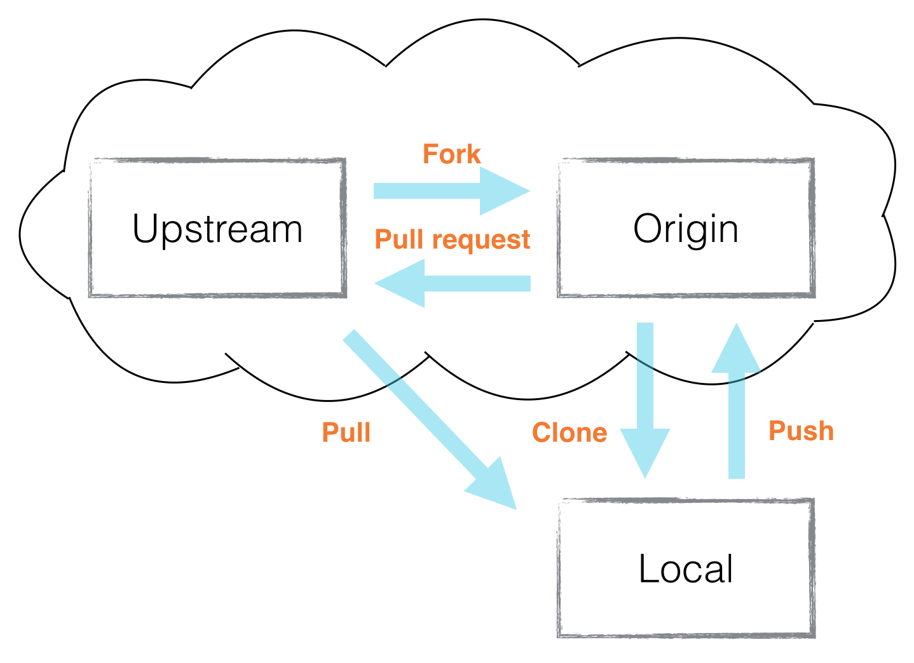
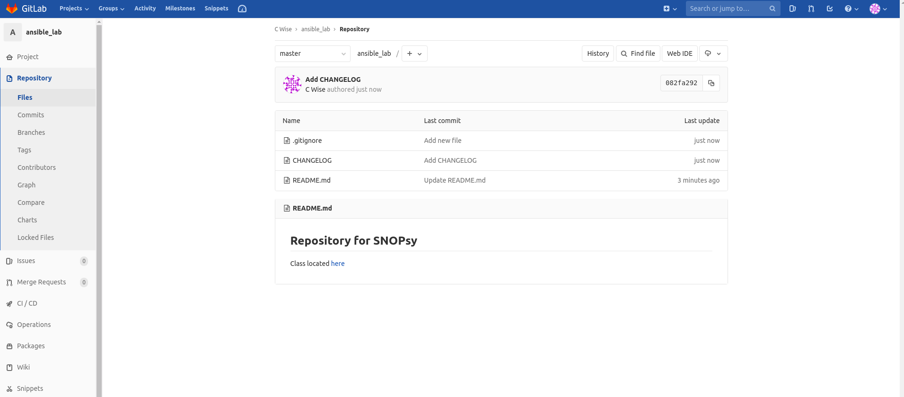
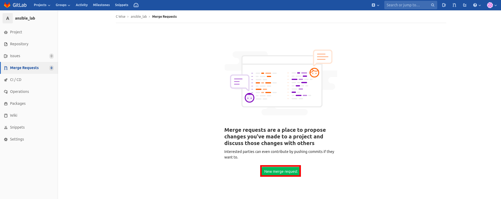
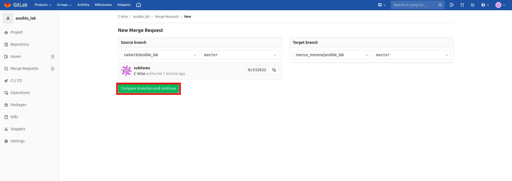
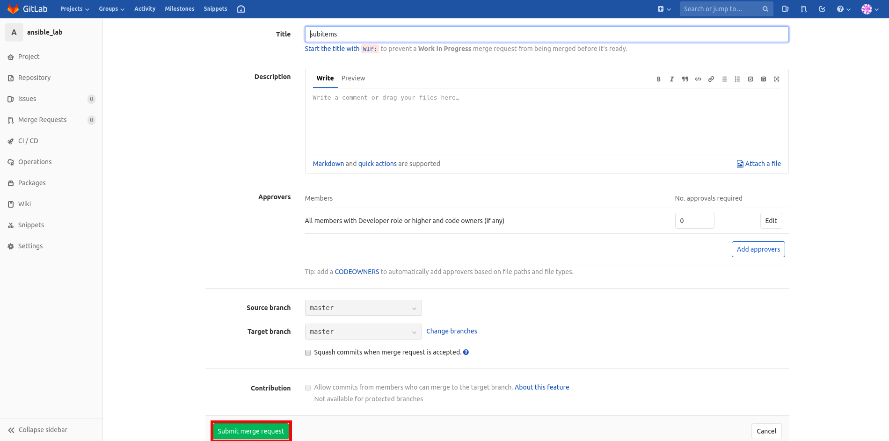
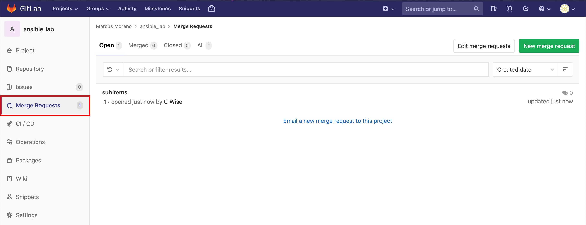
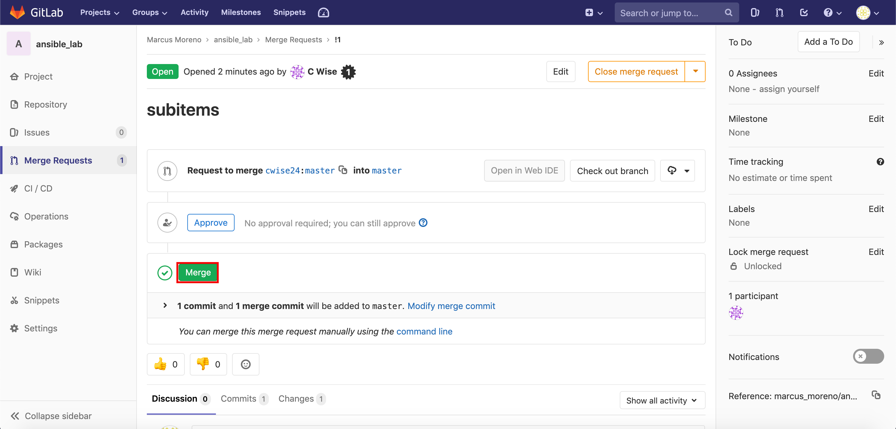
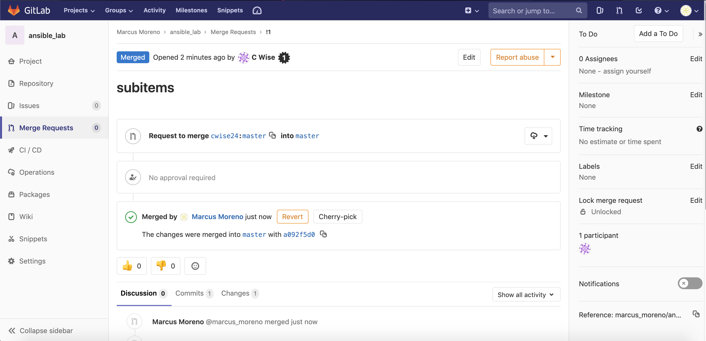

Operations
~~~~~~~~~~
Clone
^^^^^
Cloning creates a local repository (on your computer) from your repository say on Gitlab or GitHub. You cannot contribute back to the source repository (if it is not yours)  unless you are added 
as an collaborator.  For this module, we will only clone a forked repository so we may have a local working copy.

Fork
^^^^
When you fork a repository, you make a copy of the source repository and are able to freely make changes without affecting the source repository. There will be a connection between the source
repository and yours so you may contribute back.  You may also pull updates from the source repository into your fork.

I have a public repository that you can Fork `here <https://gitlab.com/cwise24/ansible_lab>`_

Origin and Upstream
^^^^^^^^^^^^^^^^

.. centered:: Fig 8

Let's check what remotes (if any) you currently have in your local repository

.. note:: If you cloned a repository you will have your origin listed

::

    git remote -v

Origin
---------
Your own repository (i.e. git@gitlab.com:your_username/your_reposity.git )
To set an origin (and origin is just a name space, could easy be just your name)
``git remote add origin git@gitlab.com:<username>/<repo>.git``

Upstream
-------------
The source repository you're forked from (i.e. git@gitlab.com:someonelse_username/their_reposity.git  )

To set an upstream:

``git remote add upstream https://gitlab.com/someonelse_username/their_reposity.git``

.. info:: If you make a typo in the upstream use ``git remote rm upstream``

Let's view our remote's now
::

    git remote -v
    origin	git@gitlab.com:your_username/ansible_lab.git (fetch)
    origin	git@gitlab.com:your_username/ansible_lab.git (push)
    upstream	https://gitlab.com/cwise24/ansible_lab.git (fetch)
    upstream	https://gitlab.com/cwise24/ansible_lab.git (push)

In case you make a mistake adding an upstream or origin (destination)

::

    git remote rm <destination>

Pull Request or Merge Request
^^^^^^^^^^^^^^^^^^^^^^

Now comes time to merge your work back into the Upstream branch or to accept a merge request(Gitlab/Gitorious) or a Pull Request(GitHub, BitBucket) from a forked contributor

Create a Merge Request
------------------------------
To create a merge request, from your repository on left side click **Merge Request**

.. centered:: Fig 9

Then click **New merge request**

.. centered:: Fig 10

You must view the compare branches before you can submit 

.. centered:: Fig 11

Click Submit Merge Request

.. centered:: Fig 12

Your submitted Merge Request

.. figure:: imgs/mr5.png
   :scale: 40%
   :align: center
.. centered:: Fig 13

Accepting a Merge Request
------------------------------

.. centered:: Fig 14

.. centered:: Fig 15

.. centered:: Fig 16

Pull from Upstream
^^^^^^^^^^^^^^
To keep your local (and origin) in sync with the upstream repository, you'll want to do either a ``fetch`` or ``pull``

::
    
    git fetch upstream <branch>
    git pull upstream <branch>

Cleaning Up
^^^^^^^^^^

When you have to delete files from your project, it can cause some issues.  And since git is making snapshots with every commit, you may find ``.bak`` files in your repository

::

    git rm -r <directory>
    git rm <file>

::

    git clean -x -n 

::

    git clean -x -f 

.. important:: Read notes on ``git clean`` before use `git clean <https://git-scm.com/docs/git-clean>`_