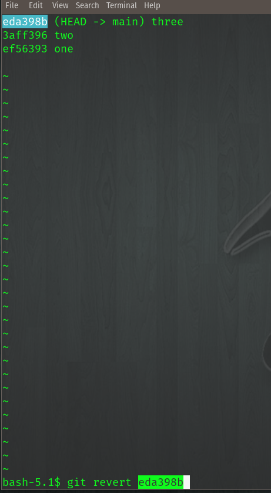
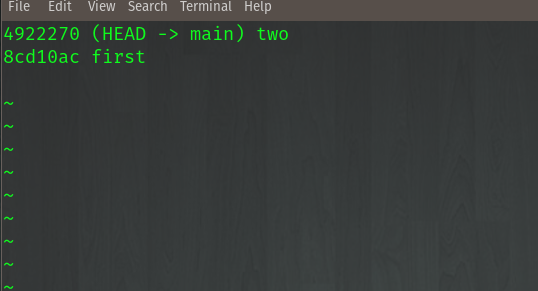
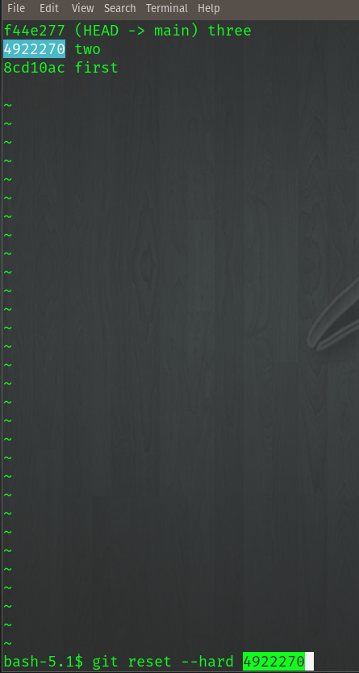
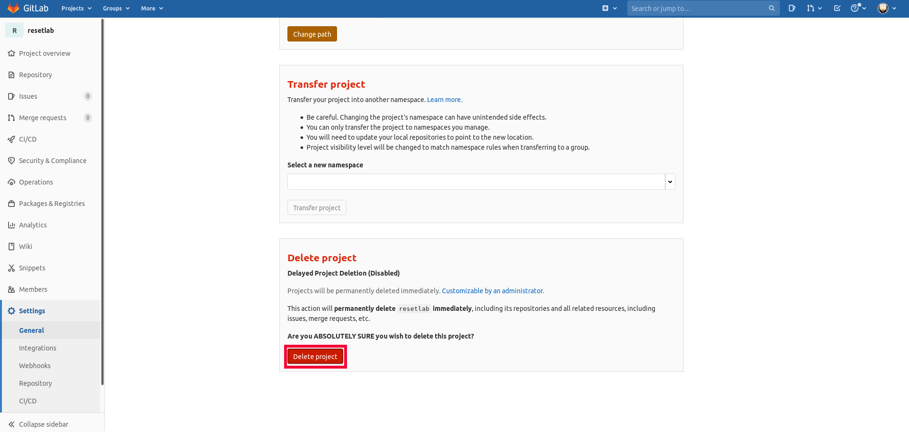

Rolling Back
~~~~~~~~~~~

How do we rollback to a previous commit? Well there are a few options. We will demo **Revert** and **Reset**.

Revert 
^^^^^

Git Revert allows the undoing of a previous commit, but it also keeps all the commit history by only adding to the commit history.  

.. note:: This is the preferred method to use.

Let's create a file named **example** then make the following edits and commits

.. code:: bash
   
   mkdir  resetlab
   cd resetlab
   git init
   vim example

Now that the file is open in *vim* use ``i`` for insert and add the following line:

``This is line one``

.. code:: bash

   :wq
   git add example 
   git commit -m "one"

Let's open the file in *vim* again and add the next line:

.. code:: bash
   
   vim example

Add this line to the example file:

``This is line two``

   And now let's save our file with the new changes, then add to staging and commit

.. code:: bash

   :wq 
   git add example 
   git commit -m "two"
   git log --oneline

Add ing the last line in:

.. code:: bash
   
   vim example

``This is line three``

And now let's save our file with the new changes, then add to staging and commit

.. code:: bash

   :wq 
   git add example 
   git commit -m "three"
   git log --oneline 

Next you will need to push this file to our repository with our 3 commits

.. code:: bash 

   git push -u git@gitlab.com:<username>/resetlab.git main
   

We will now select the commit we wish to remove, in this example it's commit three.

.. centered:: Fig 19

Once you hit enter, you will be prompted for a revert message. Once you've added the revert message and saved ``:wq`` let's review the git log 

.. code:: bash

  git log --oneline

Here we can see that instead of dropping off the thrid commit message like using ``reset`` would, with ``revert`` it actually adds an extra commit and keeps previous commit messages. This is why revert is the preferred 
rollback method.

.. image:: imgs/gitlog_revert.png
   :scale: 70%
   :align: center
.. centered:: Fig 20

Now you can push your reverted file

.. code:: bash

   git push

.. important:: Please use the :ref:`Cleanup` section below if you want to do the Reset lab

Reset
^^^^^

Reset is a simple way to "rollback" to a previous commit. The down side of reset, it will remove all the commit history back to the restoral point.
We will create a local repository and practice this.

.. code:: bash
   
   mkdir  resetlab
   cd resetlab
   git init
   vim example

Add this line to the newly created file

``This is line one`` 

.. code:: bash

   :wq 
   git add 
   git commit 
   git log --oneline

.. image:: imgs/gitlog.png
   :scale: 70%
   :align: center
.. centered:: Fig 21

Now let's edit the file **example** and add another line

.. code:: bash
   
   vim example

Add this line to the example file:

``This is line two``

   And now let's save our file with the new changes, then add to staging and commit

.. code:: bash

   :wq 
   git add example 
   git commit -m "two"
   git log --oneline

.. centered:: Fig 22

Now let's edit the file again and add another line

.. code:: bash
   
   vim example

``This is line three``

And now let's save our file with the new changes, then add to staging and commit

.. code:: bash

   :wq 
   git add example 
   git commit -m "three"
   git log --oneline 

.. image:: imgs/gitlog3.png
   :scale: 70%
   :align: center
.. centered:: Fig 23

Now let's rollback to our second commit. Using **Fig 6** as a reference we will issue the command ``git reset --hard <hash>`` with the hash of our second commit

.. centered:: Fig 24

Now the git HEAD has been moved to our second commit and we have completed a *rollback* of our file. As you can see though, all commits prior are now removed.

.. image:: imgs/gitlog_reset.png
   :scale: 70%
   :align: center
.. centered:: Fig 25

Running the command ``cat example`` we can now see the third line has been removed.

In order to push this change to our remote, you must enable **Allow Force Push** as Gitlab will set this branch as protected, but again this is not a best practice method.

Under *Settings* select *Repository*, then by Protected Branches click *Expand*

.. centered:: Fig 26

Now you can toggle *Allow force push*

.. centered:: Fig 27

.. code:: bash
   
   git push -f 

Cleanup
^^^^^^

If you want to remove a remote repository to do the reset section here are the steps

You will need to remove the files from the *resetlab* directory

.. code:: bash
    
    rm -fr .git 
    rm -fr example 

And delete the repository from Gitlab

Go to Settings and then General

.. image:: imgs/deletegitrepo1.png
   :scale: 50%
   :align: center
.. centered:: Fig 28

Scroll to bottom and find Advanced and click Expand

.. image:: imgs/deletegitrepo2.png
   :scale: 50%
   :align: center
.. centered:: Fig 29

Now click Delete project

.. centered:: Fig 30

Return to :ref:`Reset`