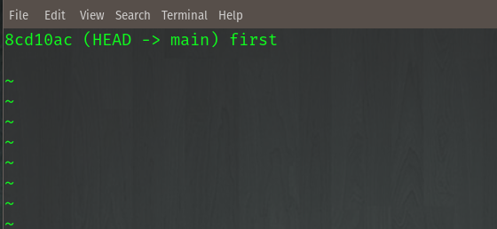
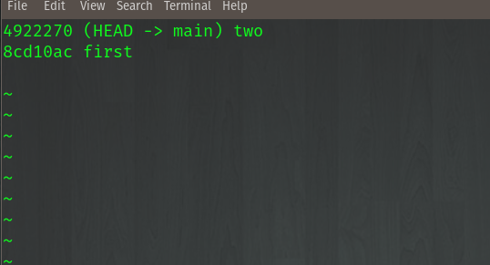
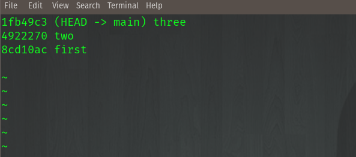
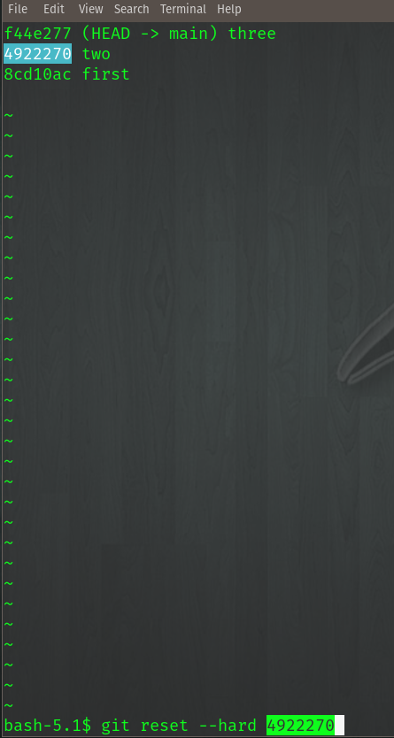

Reset 
~~~~~~~

Reset
^^^^^^

Reset is a simple way to "rollback" to a previous commit. We will create a local repository and practice this.

.. code ::
   
   mkdir  resetlab
   cd resetlab
   git init
   vim example
   This is line one 
   :wq 
   git add 
   git commit 
   git log --oneline

.. centered:: Fig 1

.. centered:: Fig 2

.. centered:: Fig 3

.. centered:: Fig 4

.. centered:: Fig 5

Revert 
^^^^^