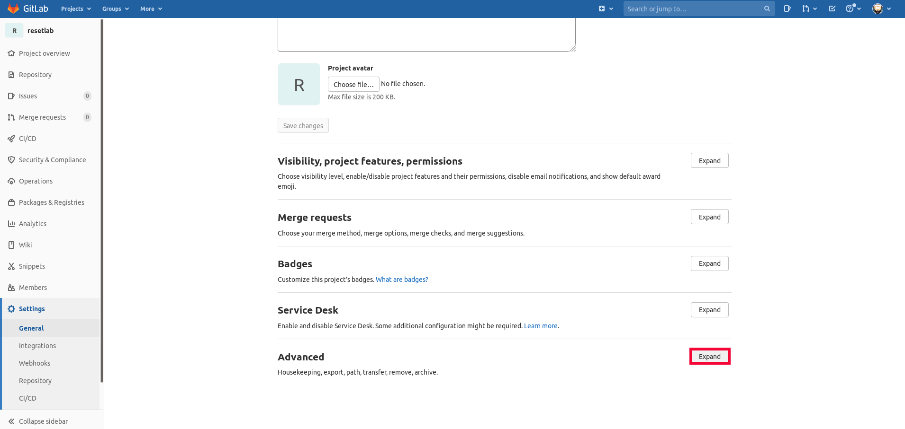

Rollback
~~~~~~~

How do we rollback to a previous commit? Well there are a couple of options. Let's cover them.

Reset
^^^^^^

Reset is a simple way to "rollback" to a previous commit. We will create a local repository and practice this.

.. code ::
   
   mkdir  resetlab
   cd resetlab
   git init
   vim example
   This is line one 
   :wq 
   git add 
   git commit 
   git log --oneline

.. figure:: imgs/gitlog.png
   :scale: 60%
   :align: center
.. centered:: Fig 1

Now let's edit the file **example** and add another line

.. code ::
   
   vim example

Add this line to the example file:

``This is line two``

   And now let's save ``:wq`` our file with the new changes, then add to staging and commit
.. code ::

   :wq 
   git add example 
   git commit -m "two"
   git log --oneline

.. figure:: imgs/gitlog2.png
   :scale: 60%
   :align: center
.. centered:: Fig 2

Now let's edit the file again and add another line

.. code ::
   
   vim example

``This is line three``

And now let's save ``:wq`` our file with the new changes, then add to staging and commit
.. code ::

   :wq 
   git add example 
   git commit -m "three"
   git log --oneline 

.. centered:: Fig 3

Now let's rollback to our second commit. Using **Fig 4** as a reference we will issue the command ``git reset --hard <hash>`` with the hash of our second commit

.. figure:: imgs/gitreset1.png
   :scale: 60%
   :align: center
.. centered:: Fig 4

Now the git HEAD has been moved to our second commit and we have completed a *rollback* of our file. 

.. figure:: imgs/gitlog_reset.png
   :scale: 60%
   :align: center
.. centered:: Fig 5

Running the command ``cat example`` we can now see the third line has been removed

Let's do some clean up before covering Revert 

.. code ::
    
    rm -fr .git 
    rm -fr example 

And delete the repository from Gitlab

Go to Settings and then General

.. figure:: imgs/deletegitrepo1.png
   :scale: 50%
   :align: center
.. centered:: Fig 6

Scroll to bottom and find Advanced and click Expand

.. centered:: Fig 7

Now click Delete project

.. figure:: imgs/deletegitrepo3.png
   :scale: 50%
   :align: center
.. centered:: Fig 8

Revert 
^^^^^

We will now select the commit we wish to remove, in this example it's commit three.

.. figure:: imgs/gitrevert1.png
   :scale: 60%
   :align: center
.. centered:: Fig 9

Once you hit enter, you will be prompted for a revert message. Once you've added the revert message and saved ``:wq`` let's review the git log 

.. code ::

  git log --oneline

Here we can see that instead of dropping off the thrid commit using ``reset``, with ``revert`` it actually adds an extra commit and keeps previous commits. This is why revert is the preferred 
rollback method.

.. figure:: imgs/gitlog_revert.png
   :scale: 60%
   :align: center
.. centered:: Fig 10

Now you can push your reverted file

.. code ::

   git push
