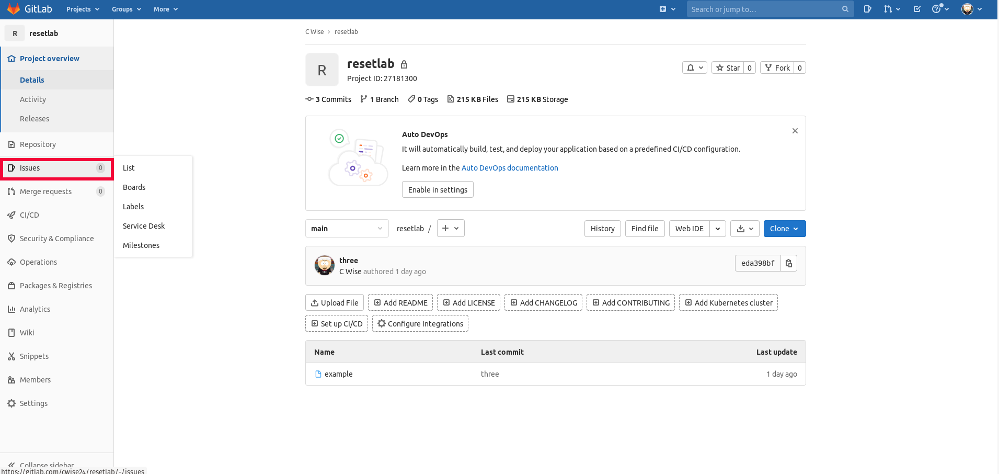
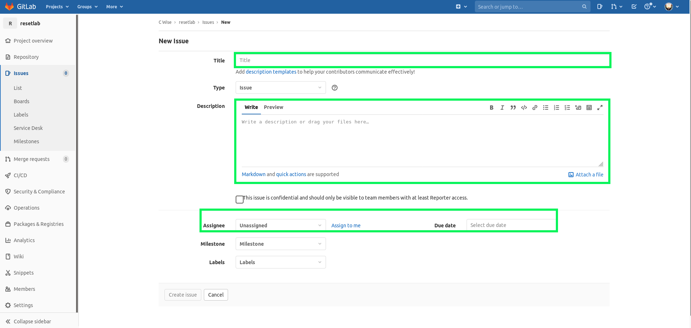

Git Extras
=========

Gitignore
-------------

A **.gitignore** is an invaluable file to have in your repository. This file explicitly tells Git what files should be ignored.
Each line in this file spcifies a file or pattern to be matched. For files like certificates, keys or other file types (i.e. pycache)
our gitignore will make sure those files do NOT become part of our public repository.

A gitignore file generator I like is `here <https://www.toptal.com/developers/gitignore>`_

Remove Remote File
--------------------------

Sometimes we make a mistake and push a file to our repository that we do not want there.  So we add it our gitignore but we still need to remove it from the remote repository. Let's remove it

.. code-block:: bash
   :caption: Remove file(s)

   git rm --cached file.txt
   git rm --cached file1.txt file2.txt
   git rm -r --cached folder

On your next `git push` you'll no longer see the remote files, make sure to add those file types to your **.gitingnore**

Issues 
---------

Filing an *issue* in Git is how we work to fix our code. From here you can:

* Identify a problem
* Assign the problem to a team or individual
* Track progress and allow others to view problems being worked
* Document Document 

.. centered:: Fig 37

When creating an issue, keep in mind that you may not be working on the problem. So include as much detail.

 * What you did, what you saw
 * What is the expected outcome
 * Versions, languages, frameworks used
 * Log output

   
.. centered:: Fig 38

Pre-Commit
-----------------
 
I had spent (aka wasted) time on using Jenkins to run linting tools on my code after a push triggered my pipeline.  As I was spending time trying to  *groovy* (Jenkins language) a simple for loop, I stumbled across
an article that made total sense, Why do this?? Why have your CI tool import a project to find problems, solve them **before** commit. I agree, so below we'll cover the setup of pre-commit

 After you have initialzed your local repo, within the ``.git`` folder you will see  ``.git/hooks`` and if we look there we will see the list of examples.

 Here is a link to the pre-commit site, but I will cover how I did it locally.

 .. code-block:: bash
    :caption: Install pre-commit
     
     pip3 install pre-commit

From your project folder you can now run 
``pre-commit install``
This will install the git hooks scripts needed

   
.. centered:: Fig 39
   

Next you'll have to add the ``.pre-commit-config.yaml`` file to your repository

.. code-block:: yaml
   :linenos:
   :caption: .pre-commit-config.yaml

   ---
   - repo: https://github.com/ansible/ansible-lint.git
     rev: v4.1.0
     hooks:
        - id: ansible-lint  

Other pre-canned hooks can be found `here <https://pre-commit.com/hooks.html>`_

Pre-commit site for `installation <https://pre-commit.com>`_  instructions

Self Signed Certificate
------------------------------

In my local lab, I have Gitlab running on a container using a self signed certificate which causes my issues for just local testing.  Within my project folder I change the
``http.sslVerify`` directive to false

.. code-block:: bash
   :caption: Turn ssl validate off

   git config --global http.sslVerify false

Tags
-------

Used to mark specific points in a repository's history. This is typically used to mark specific release points in software. Below are examples of tag creation and how to list 
existing tags.

.. code-block:: bash 
   :caption: Add tag  

   git tag -a "v1.2" -m "version 1.2"

.. code-block:: bash
   :caption: List tags

   git tag -l 

MIT IAP
------------

..  raw:: html

    <iframe width="560" height="315" src="https://www.youtube.com/embed/2sjqTHE0zok" frameborder="0" allow="accelerometer; autoplay; encrypted-media; gyroscope; picture-in-picture" allowfullscreen></iframe>

.. rubric:: Footnotes