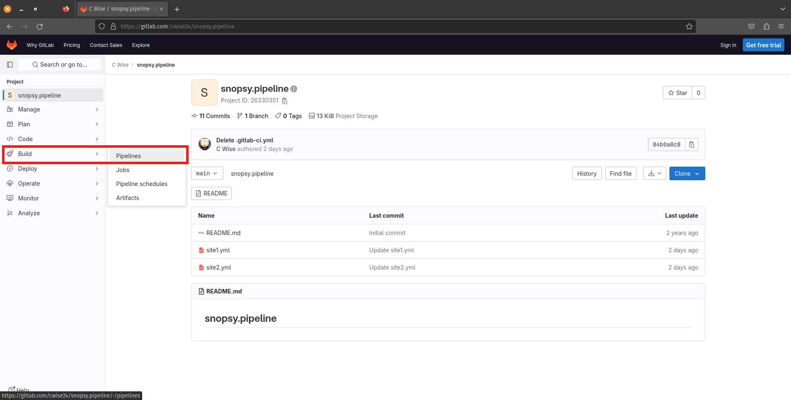
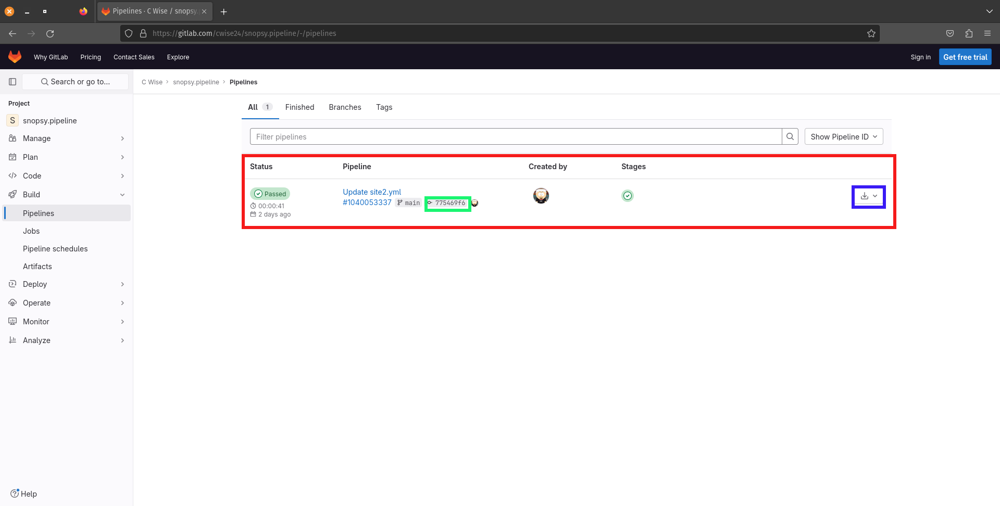
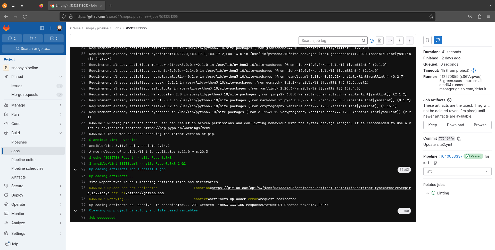

Pipeline
======

Pipelines allow for continuous integration, delivery and deployment. Anytime your repository is updated we can now run extensive testing to validate changes and produce 
reports (artifacts) proving new changes will work (or not work).

.. centered:: Fig 1

CI file
---------------

The ci file determines how the pipeline workflow will run. We can add variables, conditions and select custom container builds for our testing. Some different versions of this file are:

 - Jenkinsfile {uses Groovy lang)
 - .gitlab-ci.yml {uses YAML}

Building a simple pipeline

Here we will build a simple pipeline to run ansible-lint against our playbook to look for errors and return artifacts. Let's start off this lab with some pre-built ansible playbooks.

``git clone https://gitlab.com/cwise24/snopsy.pipeline``

Now, let's go into the new repository you just cloned

::
   
  cd snopsy.pipeline

Now you must create the the **ci** file using the below code block. Notice the variable **SITE** has the value `site2`. After your pipeline runs we will change this to `site1` and update the
repository.

.. code-block:: yaml
   :linenos:
   :caption: .gitlab-ci.yml
   :emphasize-lines: 2

   variables:
     SITE: "site2"

   stages:
      - lint 

   Linting:
     stage: lint 
     image: 
       name: cytopia/ansible-lint:latest 
       entrypoint: ["/bin/sh", "-c"]
    before_script:
      - python3 -m pip install --upgrade pip
      - python3 -m pip install ansible-lint[yamllint]
      - ansible-lint --version
    script:
      - echo "${SITE} Report" > site_Report.txt 
      - ansible-lint $SITE.yml >> site_Report.txt 2>&1
    artifacts:
      when: always
      paths:
        - site_Report.txt
      expire_in: 2 days 

Now it's time to push and create this repository with the new CI file to begin pipeline execution

::

  git add .gitlab-ci.yml 
  git commit -m "start pipeline"
  git push -u git@gitlab.com:<your_gitlab_username>/snopsy.pipeline.git 

Pipeline
-----------

The figure below shows our new pipeline completed. You can click on the commit hash (green box) to view changes and in the blue box you will be able to download artifacts (if any) generated.

.. centered:: Fig 2

You can also click on CI/CD -> Jobs and the Job number to view the logs from Gitlab Runner (Fig 4)

.. centered:: Fig 3

.. centered:: Fig 4

Now, let's change our variable SITE to ``site1`` and run the pipeline again

.. code-block:: yaml
   :linenos:
   :caption: .gitlab-ci.yml
   :emphasize-lines: 2

   variables:
     SITE: "site1"

   stages:
      - lint 

   Linting:
     stage: lint 
     image: 
       name: cytopia/ansible-lint:latest 
       entrypoint: ["/bin/sh", "-c"]
    before_script:
      - python3 -m pip install --upgrade pip
      - python3 -m pip install ansible-lint[yamllint]
      - ansible-lint --version
    script:
      - echo "${SITE} Report" > site_Report.txt 
      - ansible-lint $SITE.yml >> site_Report.txt 2>&1
    artifacts:
      when: always
      paths:
        - site_Report.txt
      expire_in: 2 days 

Now it's time to push with the updated CI file to begin pipeline execution

::

  git add .gitlab-ci.yml 
  git commit -m "site1 pipeline"
  git push

  .. rubric:: Footnote 

  .. https://docs.gitlab.com/ee/ci/yaml/