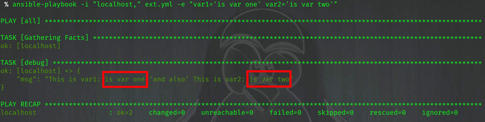
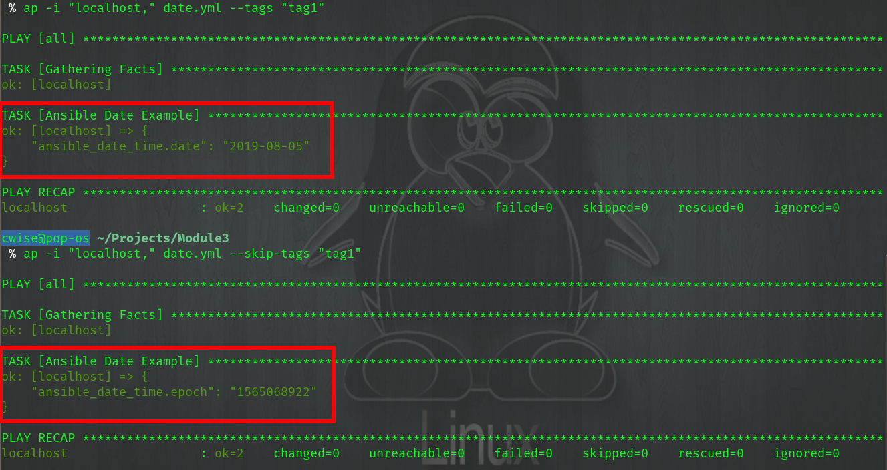

Ansible
=======

Debug
---------

This module and setting the verbose level::

    -v
    -vv
    -vvv
    -vvvv  { connection level }

will truly become your best allies as you build playbooks.  You can use debug to print registered variables to screen or even print messages.  Below I'll cover using the ``msg:`` function and 
in a very Pythonic way, concatenating stings into our messages with ``+`` and quotes.

External Vars
------------------

Let's create a new playbook called ``ext.yml`` and use the contents below

``vim ext.yml``

.. code-block:: yaml
   :caption: ext.yml
   :linenos:

   ---
   - hosts: all
     gather_facts: no
     connection: local

     tasks:

     - name: Show external variables
       debug:
         msg: "{{ \"This is var1: \" + var1 + \" 'and also' \" + \"This is var2: \" + var2 }}"

Now we'll run this play against the localhost.  A couple of items to watch when running playbooks against the localhost
The ``hosts:`` line should have the value of **all** 

| ``connection`` should have the value of **local**

::

    ansible-playbook -i "localhost," ext.yml -e "var1='is var one' var2='is var two'"

Example of connection directive missing from YAML file, you must add the ``-c`` connection switch to the cli command

::

    ansible-playbook -i "localhost," -c local ext.yml -e "var1='is var one' var2='is var two'"
    

   
.. centered:: Fig 1
Limit
-------
One way to reduce the all awesome power of automation (to kill everything) is to limit what hosts your playbooks run on.  This can be accomplished with ``limit`` or ``tags``.

The example below we run a play on only ``host1`` @ line 1 ,but @ line 2 we run the playbook against all hosts *except* ``host1``

.. code-block:: text
   :linenos:
   :caption: Limit

    ansible-playbook -i inventory someplay.yml --limit "host1"
    ansible-playbook -i inventory someplay.yml --limit "all:!host1"

Tags
^^^^^

Adding tags to individual plays can greatly help when you only want to test or skip specific plays. 

.. code-block:: yaml
   :linenos:
   :caption: tags.yml
   :emphasize-lines: 10-11,16-17

   ---
   - hosts: all
     connection: local

     tasks:

     - name: Ansible Date Example
       tags:
         - tag1
       debug:
            var=ansible_date_time.date

     - name: Set a fact
       set_fact:
          fact_var: ansible_date_time.date

     - name: Ansible Date Example
       tags: 
         - tag2
       debug:
            var=ansible_date_time.epoch

Only show date ``ansible-playbook -i inventory someplay.yml --tags "tag1"``

Only show epoch ``ansible-playbook -i inventory someplay.yml --skip-tags "tag1"``

.. centered:: Fig 2

Loops
---------

My most commonly used looping methods. In nearly all cases with_items is fine to use but you should start using loop.

* with_items
* loop 

.. code-block:: yaml
   :caption: loop.yml 
   :linenos:

   ---
   - hosts: all
     gather_facts: False
     connection: local 

     tasks:

     - name: A loop 
       debug:
         msg: "{{ item }}"
       loop:
         - one
         - two
         - three

Conditionals
-----------------

There are too many to cover and that's why we have the internet.  `Ansible Docs <https://docs.ansible.com/ansible/latest/user_guide/playbooks_error_handling.html>`_

My most used:
 * ignore_errors
 * until/retries/delay
 * status_code
 * when
 * fail_when

This play will download the *vault_play.png* if it does not exist within the specified directory (the ``path`` directive), you 
can add this to the end of **tags.yml** playbook

.. code-block:: yaml 
   :linenos:
   :caption: File Exists Check

   - name: Check if image file exists
     stat:
       path: "~/Downloads"
     register: file_stat

   - name: Download png file from my repo
     get_url:
       url: https://github.com/cwise24/snopsy/raw/master/docs/module3/imgs/vault_play.png
       dest: "~/Downloads"
     when: file.stat.exists == False

Pause
--------------

Give a process time before running the next inline task

.. code-block:: yaml
   :linenos:
   :caption: Pause

   - pause:
        seconds: 10

When an action fails, prompt user to accept and continue rather than stop/fail.  Let's add the below code to the end of your *tags.yml* playbook

.. code-block:: yaml
   :linenos:
   :caption: Pause & Prompt

   - pause:
       prompt: " Press Enter to continue "
     when: fact_var is defined

Meta
--------

In one of my playbooks I use dynamic inventory to populate my inventory file, meaning I must refresh (inventory files are loaded at runtime)

.. code-block:: yaml
   :linenos:
   :caption: refresh inventory

   - meta: refresh_inventory

Ansible Git
--------------

Clone a git repo using Ansible. For this exercise we will clone an existing repo in Gitlab. We will use this repo to demo hostvar. 
Let's create a new playbook called *getrepo.yml* and add the code below:

..code-block:: yaml 
  :linenos:
  :caption: getrepo.yml 

  ---
  - name: Clone git repo
    hosts: all 
    gather_facts: no 
    connection: local 

    tasks:

   - name: Check if project folder exists
     ansible.builtin.stat: 
       path: ./snopsy.hostvars 
     register: dir_exits 

    - name: Clone Repo for next exercise
      ansible.builtin.git:
        repo: https://gitlab.com/cwise24/snopsy.hostvars 
        dest: ~/ansible_lab/snopsy.hostvars
        clone: yes
        force: yes 
      when: dir_exists.stat.exists == false 

Now to execute

``ansible-playbook -i "localhost," getrepo.yml``

Host Variables
-------------------

.. code-block:: yaml
   :linenos:
   :caption: names.yml 

  ---
  - name: Show hostvar use cases
    hosts: all
    gather_facts: no
  
    tasks:
  
    - name: Show hostvars (all hosts)
      debug:
        var: hostvars 
  
    - name: Show inventory hostnames
      debug: 
        var: inventory_hostname 
  
    - name: Show ip addresses of all hosts
      debug:
        msg: "{{ hostvars[inventory_hostname]['ansible_host'] }}"
  
    - name: Show ip address of host_2 only
      debug: 
        msg: "{{ hostvars['host_2']['ansible_host'] }}" 
      when: inventory_hostname == "host_2"
  
    - name: Show groups and hosts within each group
      debug:
        msg: "{{ groups }}"
  
    - name: Show group names
      debug:
        msg: "{{ group_names }}"
  

Network Automation
---------------------------
No reason for me to repeat, `Ansible Docs <https://docs.ansible.com/ansible/latest/network/getting_started/network_differences.html>`_