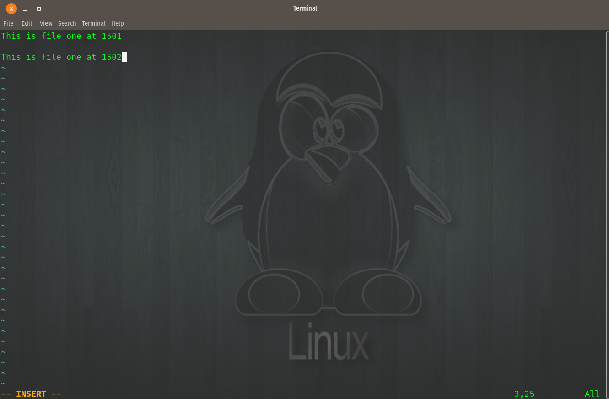

Linux
======

Some VIM features I used for this project

::

    Shift + G           { last line }
    Shift + $           { end of line }
    Shift + V           { block editor }
    y                   { yank }
    Shift + P           { paste }
    dd                  { delete/cut }

To edit files in VIM with tabs use the command  ``:tabedit <filename>``

.. figure:: imgs/tabedit1.png
   :scale: 50%
   :align: center
.. centered:: Fig 1

Now both files will show

.. figure:: imgs/tabedit2.png
   :scale: 50%
   :align: center
.. centered:: Fig 2
To navigate between tabs use the keys
 * gt
 * gT

Go back in time to earlier versions

::

    :earlier 2m

Examples:

.. centered:: Fig 3

.. figure:: imgs/time2.png
   :scale: 50%
   :align: center
.. centered:: Fig 4

.. figure:: imgs/time3.png
   :scale: 50%
   :align: center
.. centered:: Fig 5