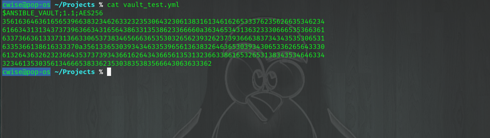

Vault
=====

We will use ansible vault to encrypt all of our sensitive information AND to make sure our playbooks stay automated. I'm not saying this is the only way but this is how I 
keep my playbooks automated without having to enter any credentials.

Let's create a new *master* ansible-vault key, this will be stored as a hidden file within your home directory

::

    vim .vault.key
    
    s3cr3T1

From the ``ansible.cfg`` in Module 1, we'll now un-comment the ``vault_password_file`` directive

.. code-block:: bash
   :emphasize-lines: 6

    vim ansible.cfg

    [defaults]
    Host_key_checking = False
    Log_path = ~/ansible_lab
    vault_password_file = .vault.key

Now you may create new files by using ``ansible-vault create <filename>``, this will create the new file and open vim. This new file will use the passphrase from our previously generated file
``.vault.key``

To encrypt an existing file ``ansible-vault encrypt <filename>`` and you will be prompted for the new passphrase 

.. note:: If you configure the ``vault_password_file`` this will automatically be used as the passphrase and you will **NOT** be prompted

Some useful vault commands:

|  ``ansible-vault edit <filename>`` will decrypt and open the file in vim
|  ``ansible-vault decrypt <filename>`` returns file to plain-text status 
|  ``ansible-vault re-key <filename>`` to assign a new passphrase to the file, again see **Note** above on ``vault_password_file``

Experimentation
---------------------

Now let's build a playbook and a encrypted file to show vault in action 
``vim vault_play.yml``

.. code-block:: yaml
   :caption: vault_play.yml

   ---
   - hosts: all
     connection: local

     tasks:

     - name: Debug variables
       debug:
           msg: 
             - "{{ \"This is var1: \" + var1 }}"
             - "{{ \"This is var2: \" + var2 }}"

And now for the file we will encrypt
``ansible-vault create vault_test.yml``

.. code-block:: yaml
   :caption: vault_test.yml

   ---
   var1: "is var one"
   var2: "is var two"

Let's view our newly created and enccryted file ``cat vault_test.yml``

.. centered:: Fig 3

Now to run our play we will use the below command, calling our localhost as the only inventory member, our ``vault_play.yml`` play file and passing in the external ``-e`` vault file ``@vault_test.yml``
::

    ansible-playbook -i "localhost," vault_play.yml -e "@vault_test.yml"

.. centered:: Fig 4

Playbooks
--------------

Now that some basics are covered with vault, I will cover how to implement vault with automated playbooks.

Create a *become* sudo password file to encrypt, remember that this is a YAML file and vault will expect the file to be in a *dictionary* format ``key: value``

``vim pass.yml``

.. code-block:: yaml
   :linenos:    
    
    ---
    sudo_become: "S3creT!"

Standard playbook call without vault, from Module 1 the ``-b`` switch is for *Become* and the ``-K`` is *ask for password*.  Not very automated at all if you have to sit at the keyboard
::
    ansible-playbook -i inventory someplay.yml -b -K 

With ansible vault and a modification to your inventory file like below.  Notice my KVM Hypervisor group ``[kvm_hv]`` has a hostvar association ``[kvm_hv:vars]``. Let's evaluate our playbook again

Inventory host variable::

    [kvm_hv]
    localhost

    [kvm_hv:vars]
    ansible_become_pass="{{ sudo_become }}"

Ansible Play::

    ansible-playbook -i inventory someplay.yml -e "@pass.yml"

.. blockdiag::
   
    blockdiag {
    
        default_node_color = lightyellow;
        default_textcolor = black;
        default_shape = roundedbox;
        
        Inventory -> Play;
        Pass.yml -> ansible.cfg  [label = "Encrypt", color = "green" ];
        ansible.cfg -> Play  [label = "Decrypt", color = "red" ];
        Play -> Target [label = "SSH" ];
        }