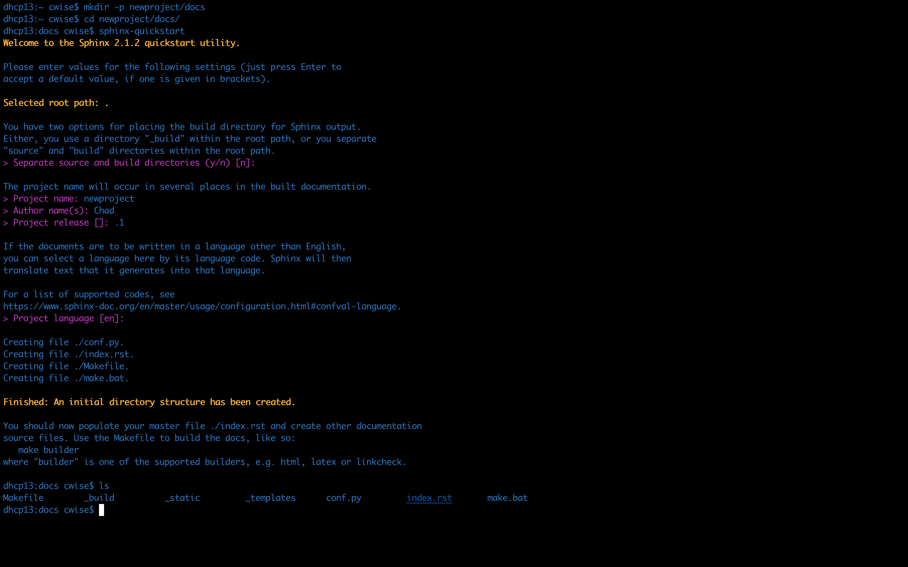
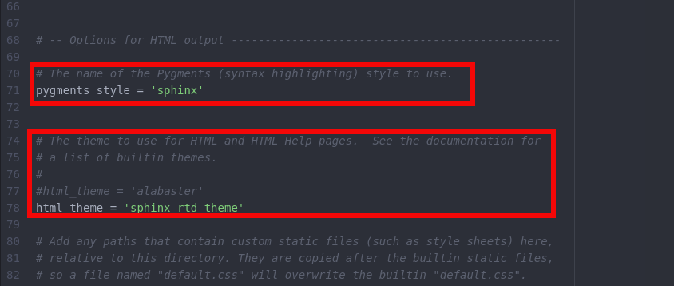
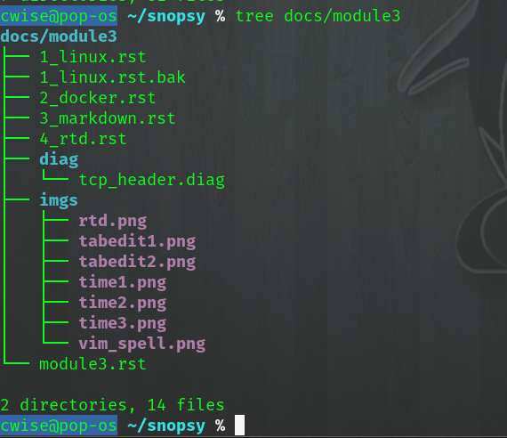

ReadTheDocs 
===========

Sphinx
~~~~~~~

::

     pip3 install sphinx
     pip3 install sphinx sphinx-autobuild 
     pip3 install sphinxcontrib-nwdiag  { requires extra configs }

First create a new directory to start your project
::

    mkdir -p newproject/docs
    cd newproject/docs
    sphinx-quickstart

.. centered:: Fig 1

You can also edit the ``conf.py`` file to use specific themes.  Alabaster is the default but from the image below I changed mine to use ``sphinx_rtd_theme``, to render this new themes
locally (sphinx-autobuild) you will need to install ``pip3 install sphinx-rtd-theme`` 

.. centered:: Fig 2

Now build your html pages

::

    sphinx-build -b html . _build/html

To run the files/builds locally and see how the web links and pages are run

::

    sphinx-autobuild -b html . _build/html 

.. note:: Watch for errors on the cli when autobuild runs

From here you can navigate to localhost:8000 from your browser

Table of Contents building, you must add ``:glob:`` if you plan to use a wildcard ``*``.  Below will search the directory structure for the module folders, followed by the moduleN.rst file to show the local table of contents

::

    .. toctree::
    :maxdepth: 1
    :caption: Contents:
    :glob:

    module*/module*

.. centered:: Fig 3

I used individual folders for each module and in this example I will cover ``module3``. This breaks down the individual module Table of Contents (toc)

.. literalinclude:: module3.rst 
   :linenos:

Bullets
~~~~~~

Bullets

* item
- item

::

    Bullets

    * item
    - item

Images/Figures
~~~~~~~~~~~~~

To place images or figures on pages.  I can use ``.. figure::`` or ``.. image::`` and set a ``:scale:``, this way the image can be opened

.. centered:: Fig 4

.. centered:: Image 1
::

    .. figure:: imgs/rtd.png
       :scale: 50%
       :align: center
    .. centered:: Fig 4

    .. image:: imgs/rtd.png
       :align: center
       :scale: 50%
    .. centered:: Image 1

Code Blocks
~~~~~~~~~~~

Example below, `reference <www.sphinx-doc.org/es/stable/markup/code.html>`_

.. code-block:: html
   :linenos:
   :emphasize-lines: 2-4,6

   <html>
   <head>
   <link rel="stylesheet" type="text/css" href="mystyle.css">
   <title> Title</title>
   </head>
   <body>
   Text
   </body>
   </html>

You use the ``:emphasize-lines:`` directive to highlight a line or lines of code, and the ``:linenos:`` to add line numbers
::

    .. code-block:: html
       :linenos:
       :emphasize-lines: 2-4,6

       <html>
       <title> Title</title>
       <body>
       Text
       </body>
       </html>

After the ``.. code-block::`` directive you can add the language or use ``text`` as below

.. code-block:: text
   :linenos:

    mkdir X
    rm -rf X
   
::

    .. code-block:: text
       :linenos:
       
       mkdir X
       rm -rf X

One other good ability to to present code/files that already exist within your repository.  The ``.. literalinclude::`` directive does this for us

::

    .. literalinclude:: path/to/file
       :linenos:

Notes_Warnings
~~~~~~~~~~~~~~

.. note:: This is a note
.. seealso:: See also
.. warning:: Warning ``here``
.. todo:: Todo see the next section for extensions and todo_include_todos
.. important:: Important
.. versionadded:: 1.2
.. versionchanged:: 2.1
.. deprecated:: 1.1

::

    .. note:: This is a note
    .. seealso:: See also
    .. warning:: Warning ``here``
    .. todo:: Todo see the next section for extensions and todo_include_todos
    .. important:: Important
    .. versionadded:: 1.2
    .. versionchanged:: 2.1
    .. deprecated:: 1.1 

Network Diagrams
~~~~~~~~~~~~~~~~

Edit the conf.py file to include new extensions::

    extensions = [
    'sphinx.ext.autodoc',
    'sphinx.ext.doctest',
    'sphinx.ext.todo',
    'sphinx.ext.coverage',
    'sphinx.ext.mathjax',
    'sphinx.ext.ifconfig',
    'sphinx.ext.viewcode',
    'sphinx.ext.graphviz',
    'sphinxcontrib.nwdiag',
    'sphinxcontrib.rackdiag',
    'sphinxcontrib.packetdiag',
     'sphinx.ext.todo'
     ]

     todo_include_todos=True

You must also create a ``requirements.txt`` file and add::

    sphinxcontrib-nwdiag

This now enables
::
    .. nwdiag:: 

        nwdiag {
          network dmz {
              web01;
              web02;
            }
        }

Example Diagrams

.. nwdiag::

    nwdiag {
      network dmz {
          web01;
          web02;
       }
    }

Or highlight groups

::

    .. nwdiag::

       nwdiag{
          network web_tier {
            address = "172.10.1.0/24";
              //define group
                group web {
                  web01 [ address = ".1 "];
                  web02 [address  = ".2"];
               }
            }
        network db {
           address = "172.20.1.0/24";
              web01 [ address = ".1"];
              web02 [ address = ".1"];
              db01 [ address = ".101"];
              db02 [ address = ".102"];
              group db {
                 db01;
                 db02;
                 }
            }
        }

.. nwdiag::

   nwdiag{
      network web_tier {
        address = "172.10.1.0/24";
          //define group
            group web {
              web01 [ address = ".1 "];
              web02 [address  = ".2"];
           }
        }
    network db {
       address = "172.20.1.0/24";
          web01 [ address = ".1"];
          web02 [ address = ".1"];
          db01 [ address = ".101"];
          db02 [ address = ".102"];
          group db {
             db01;
             db02;
             }
        }
    }

Rack El 
^^^^^^

::

    .. rackdiag::

   rackdiag {
       rack {
       //define height of rack
       8U;
        //define description
        description = "Rack A1";
       //define position of items
       1: UPS
       2: UPS
       7: TOR Switch [10A]  //define Amps
       8: Fuse Panel
      }
      
       rack {
       8U;
       description = "Rack A2";
       1: UPS
       2: UCS
       2: UCS
       3: N/A [4U];
       7: TOR Switch 
       8: Fuse Panel
       }
   }

.. rackdiag::

   rackdiag {
        rack {
    //define height of rack
    8U;
     //define description
     description = "Rack A1";
    //define position of items
    1: UPS
    2: UPS
    7: TOR Switch [10A]
    8: Fuse Panel
   }

    rack {
    8U;
    description = "Rack A2";
    1: UPS
    2: UCS
    2: UCS
    3: N/A [4U];
    7: TOR Switch
    8: Fuse Panel
    }
   }

Packet Diagrams
^^^^^^^^^^^^^

.. literalinclude:: diag/tcp_header.diag

.. packetdiag:: 

   packetdiag {
    colwidth = 32
    node_height = 72
    0-15: Src Port
    16-31: Destination Port
    32-63: Sequence Number
    64-95: Acknowledgment Number
    96-99: Data Offset
    100-105: Reserved
    106: URG
    107: ACK 
    108: PSH 
    109: RST 
    110: SYN 
    111: FIN
    112-127: Window
    128-143: Checksum
    144-159: Urgent Pointer
    160-191: (Options and Padding)
    192-223: data [colheight = 3]   
    }

Links and References
~~~~~~~~~~~~~~~~~~

`Link <www.google.com>`_ 

::

    `Link <www.google.com>`_

Something quoted [#]_

.. rubric:: Footnote

.. [#] https://www.google.com/

Using the ``[#]`` will auto number the footnotes
::

    Something quoted [#]_

    .. rubric:: Footnote
    
    .. [#] https://www.google.com