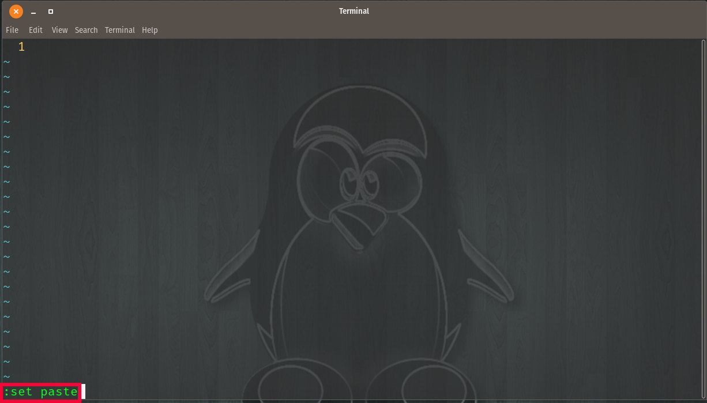
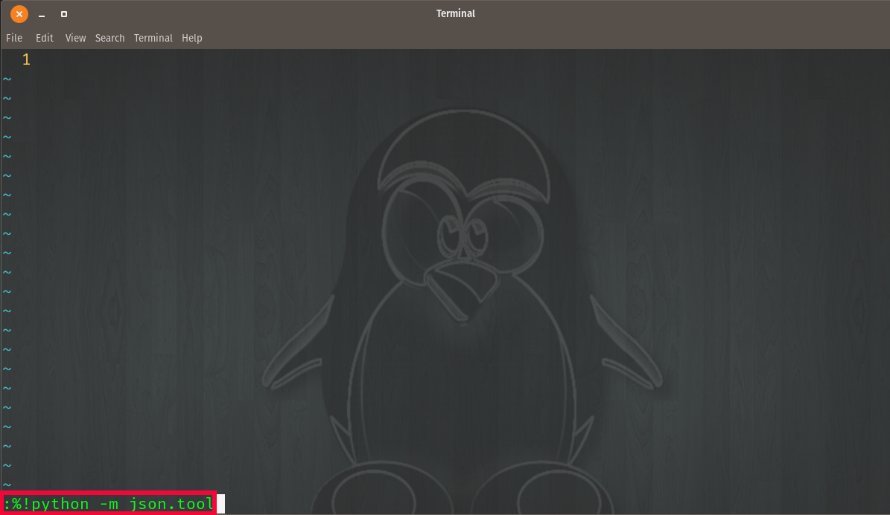

JSON
=====

JSON data structure
Objects and Arrays
Working JSON data in VIM

Using the ``set paste`` command in VIM

.. centered:: Fig 1

What about when you use set paste and the formatting is still a mess?  No worries, use this python command in VIM   
``%!python -m json.tool``

.. centered:: Fig 2

Parsing
--------

In these examples, you'll be working with **jq** to extract specific JSON data.

.. code-block:: json 

    {
      "data": [
        {
          "gid": "001",
          "name": "project_1",
          "data_type": "json"
        },
        {
          "gid": "002",
          "name": "project_2",
          "data_type": "json"
        },
        {
          "gid": "003",
          "name": "project_3",
          "data_type": "json"
        }
      ]

2 styles used in parsing JSON data:
 * dot notation       `$.data[0].gid`         response: 001   
 * bracket notation   `$.['data'][0]['gid']`  response: 001   

.. note:: In Ansible, bracket notation is preferred