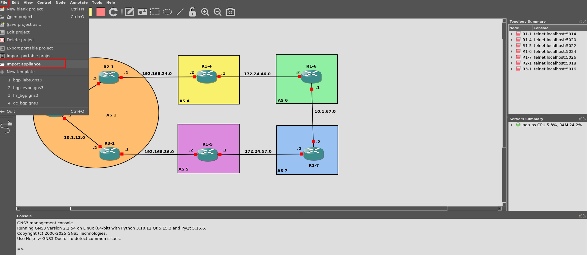

Self Hosted
===========

The installation process listed below is from running this lab on my own Linux laptop with Pop_OS (Ubuntu base). You may have to alter some of the commands to get
gns3 installed/started, but after that we'll only be working with the gns3 UI.

* install `gns3`_

.. _gns3: (https://www.gns3.com/software/download)

* set `permissions`_ for packet tracer (Linux)

.. _permissions: https://askubuntu.com/questions/748941/im-not-able-to-use-wireshark-couldnt-run-usr-bin-dumpcap-in-child-process

* download the FRR `image`_

.. _image: https://www.gns3.com/frr

You'll now need to add the image as an applicance from the UI.

Configurations provided in the hosted lab. You'll need to add these configurations to the routers based on name below. This will *catch you up* to users of the hosted 
lab.

Please see next section for starting routers and accessing their console.

.. code-block:: bash
   :caption: Router 1-1 Config

   ##R1-1
   enable
   config t
   hostname R1-1
   frr defaults datacenter
   int eth0 
   ip address 10.1.12.1/24
   int eth1
   ip address 10.1.13.1/24
   no shut
   int lo
   ip address 1.1.1.1/32
   no shut
   router bgp 1
   no bgp ebgp-requires-policy
   bgp router-id 1.1.1.1
   neighbor 10.1.12.2 remote-as 1
   neighbor 10.1.12.2 route-reflector-client
   network 1.1.1.1 mask 255.255.255.255
   do wr mem
   
.. code-block:: bash
   :caption: Router 2-1 Config
   
   ##R2-1
   enable
   config t
   hostname R2-1
   frr defaults datacenter
   int eth0 
   ip address 10.1.12.2/24
   int eth1
   ip address 192.168.24.1/24
   no shut
   int lo
   ip address 1.1.1.2/32
   no shut
   router bgp 1
   no bgp ebgp-requires-policy
   bgp router-id 1.1.1.2
   neighbor 10.1.12.1 remote-as 1
   neighbor 192.168.24.2 remote-as 4
   network 10.1.12.0/24
   do wr mem
   
.. code-block:: bash
   :caption: Router 3-1 Config
   
   ##R3-1
   enable
   config t
   hostname R3-1
   frr defaults datacenter
   int eth0 
   ip address 10.1.13.2/24
   desc link to R1-1
   int eth1
   ip address 192.168.36.1/24
   desc link to R1-5
   no shut
   int lo
   ip address 1.1.1.3/32
   no shut
   do wr mem
   
.. code-block:: bash
   :caption: Router 4-1 Config
   
   ##R1-4
   enable
   config t
   hostname R1-4
   frr defaults datacenter
   int eth0 
   ip address 192.168.24.2/24
   int eth1
   ip address 172.24.46.1/24
   no shut
   int lo
   ip address 4.4.4.4/32
   no shut
   router bgp 4
   no bgp ebgp-requires-policy
   bgp router-id 4.4.4.4
   neighbor 192.168.24.1 remote-as 1
   neighbor 172.24.46.2 remote-as 6
   address-family ipv4 unicast
   redistribute connected
   do wr mem
   
.. code-block:: bash
   :caption: Router 5-1 Config
   
   ##R1-5
   enable
   config t
   hostname R1-5
   frr defaults datacenter
   int eth0 
   ip address 192.168.36.2/24
   desc link to R3-1
   no shut
   int eth1
   no shut
   ip address 172.24.57.1/24
   no shut
   int lo
   ip address 5.5.5.5/32
   no shut
   #remove below##############
   router bgp 5
   no bgp ebgp-requires-policy
   bgp router-id 5.5.5.5
   neighbor 192.168.36.1 remote-as 1
   neighbor 172.24.57.2 remote-as 7
   address-family ipv4 unicast
   redistribute connected
   ###########################
   do wr mem
   
.. code-block:: bash
   :caption: Router 6-1 Config
   
   ##R1-6
   enable
   config t
   hostname R1-6
   frr defaults datacenter
   int eth0 
   ip address 172.24.46.2/24
   desc link to R1-4
   no shut
   int eth1
   ip address 10.1.67.1/24
   desc link to R1-7
   no shut
   int lo
   ip address 6.6.6.6/32
   no shut
   ## remove below ###############
   ip route 6.6.6.0/24 null0
   router bgp 6
   no bgp ebgp-requires-policy
   bgp router-id 6.6.6.6
   neighbor 172.24.46.1 remote-as 4
   neighbor 10.1.67.2 remote-as 7
   network 6.6.6.0 mask 255.255.255.0
   ###################################
   do wr mem
   
.. code-block:: bash
   :caption: Router 7-1 Config
   
   ##R1-7
   enable
   config t
   hostname R1-7
   frr defaults datacenter
   int eth0 
   ip address 172.24.57.2/24
   desc link to R1-5
   no shut
   int eth1
   ip address 10.1.67.2/24
   desc link to R1-6
   no shut
   int lo
   ip address 7.7.7.7/32
   no shut
   ## remove below#########################
   ip route 7.7.7.0/24 null0
   router bgp 7
   no bgp ebgp-requires-policy
   bgp router-id 7.7.7.7
   neighbor 172.24.57.1 remote-as 5
   neighbor 10.1.67.1 remote-as 6
   network 7.7.7.0 mask 255.255.255.0
   #######################################
   do wr mem

With these configurations now in place, you are ready to begin the lab. All routers should have all interfaces assigned now and even a few are set up to form BGP peers.