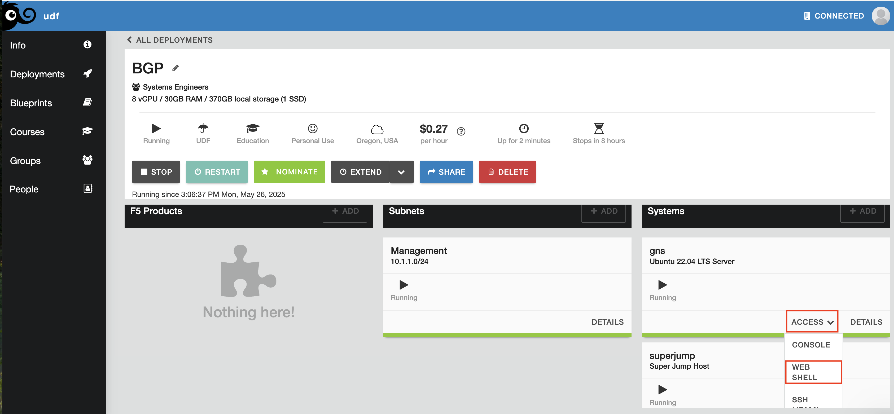
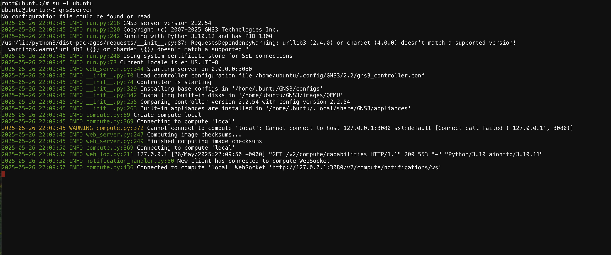
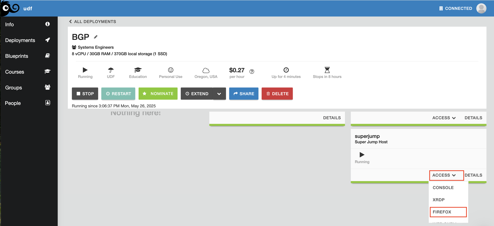
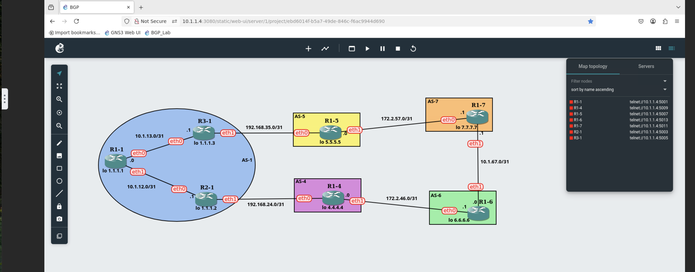
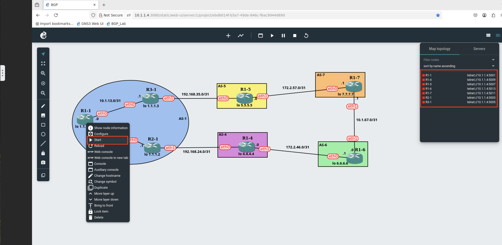
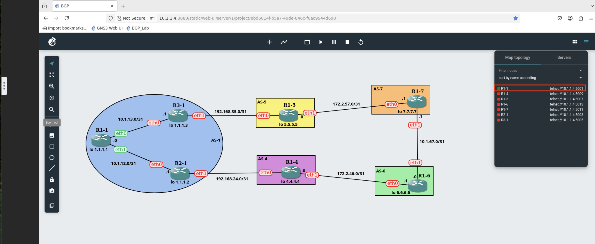

Hosted
======

Once you've started the UDF course. Navigate to the **gns** system box and select the *ACCESS* dropdown and click on *WEB SHELL*

Once open, issue the commands

.. code-block:: bash
   :caption: gns3 

   su -l ubuntu 
   gns3server

Once the GNS3 server is up and running, we'll now use the web UI to access the BGP lab. Open the *FIREFOX* option from the *ACCESS* dropdown

   
From the new Firefox tab, open the BGP_Lab bookmark

.. image:: imgs/bgpbookmark.png
   :caption: bookmark

