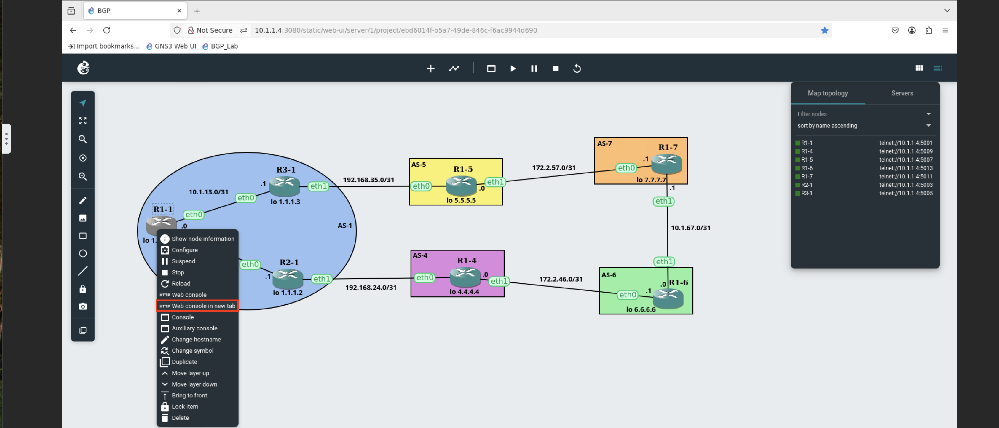

Hosted
======

Once you've started the UDF course. Navigate to the **gns** system box and select the *ACCESS* dropdown and click on *WEB SHELL*

.. image:: imgs/webshell.png 
   :align: center
   :scale: 70%

Once open, issue the commands

.. code-block:: bash
   :caption: gns3 

   su -l ubuntu 
   gns3server

.. image:: imgs/gns3server.png
   :caption: gns3
   :align: center
   :scale: 70%

Once the GNS3 server is up and running, we'll now use the web UI to access the BGP lab. Open the *FIREFOX* option from the *ACCESS* dropdown

.. image:: imgs/firefox.png
   :caption: gns3
   :align: center
   :scale: 70%
   
From the new Firefox tab, open the BGP_Lab bookmark.

.. image:: imgs/bgpbookmark.png
   :caption: bookmark
   :align: center
   :scale: 70%

You should now see the lab topology like below.

.. image:: imgs/bgplabui.png
   :caption: Lab UI 
   :align: center
   :scale: 70%

The nameing conventions for the routers are **R** for router, the number router and the ASN the router is in. So R1-1 is Router 1 in the autonomous system 1.

Hover your mouse over **R1-1** and right click to show the router options, we will be starting the router.

.. image:: imgs/start.png
   :caption: Start Router
   :align: center
   :scale: 70%

Once the router is started you should now see in the legend to the far right it's greem status.

.. image:: imgs/running.png
   :caption: Running
   :align: center
   :scale: 70%

Now you'll need to start each router, we are doing it this way to keep resoure utilization down. If we started all the routers at once it would overwhelm the VM we have.
Please allow each router to start before starting the next one.

Once all the routers are started, you should see them all in the legend to the far right with green status. Now you can open the GNS3 web console for each router.

   