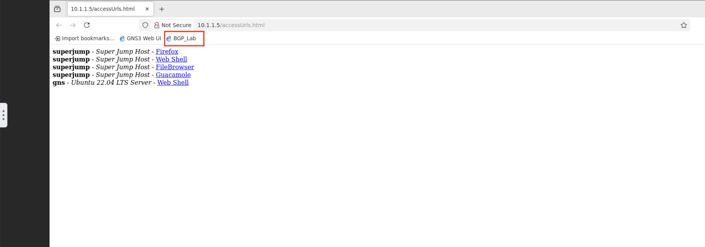

Hosted
======

Once you've started the UDF course. Navigate to the **gns** system box and select the *ACCESS* dropdown and click on *WEB SHELL*

.. image:: imgs/webshell.png 
   :align: center
   :scale: 70%

Once open, issue the commands

.. code-block:: bash
   :caption: gns3 

   su -l ubuntu 
   gns3server

.. image:: imgs/gns3server.png
   :caption: gns3

Once the GNS3 server is up and running, we'll now use the web UI to access the BGP lab. Open the *FIREFOX* option from the *ACCESS* dropdown

.. image:: imgs/firefox.png
   :caption: gns3
   
From the new Firefox tab, open the BGP_Lab bookmark.

You should now see the lab topology like below.

.. image:: imgs/bgplabui.png
   :caption: Lab UI 

The nameing conventions for the routers are **R** for router, the number router and the ASN the router is in. So R1-1 is Router 1 in the autonomous system 1.

Hover your mouse over **R1-1** and right click to show the router options, we will be starting the router.

.. image:: imgs/start.png
   :caption: Start Router

Once the router is started you should now see in the legend to the far right it's greem status.

