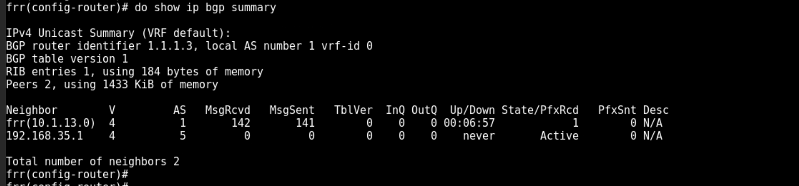
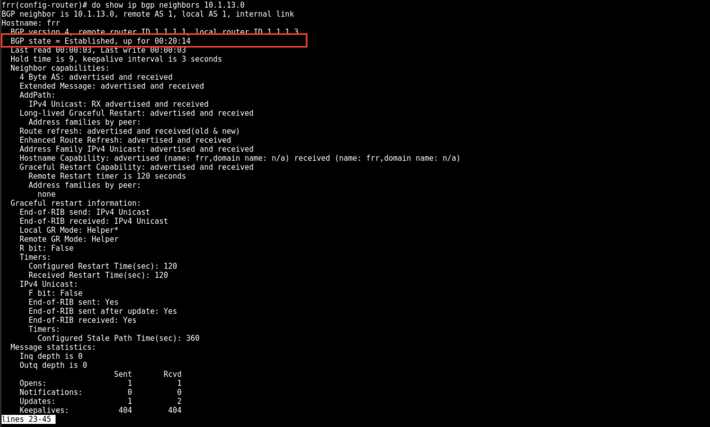
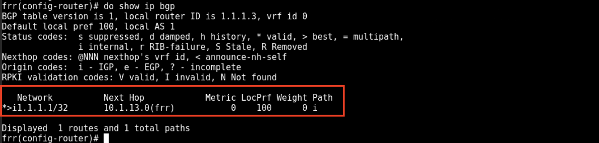
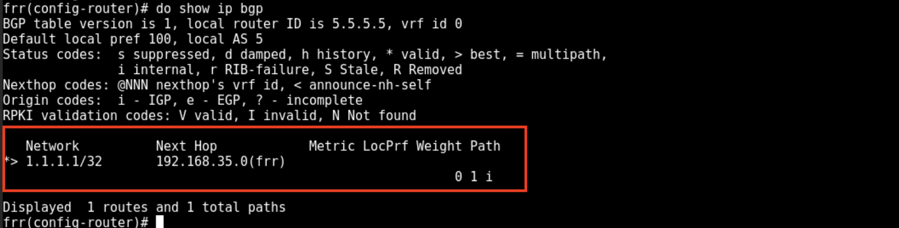
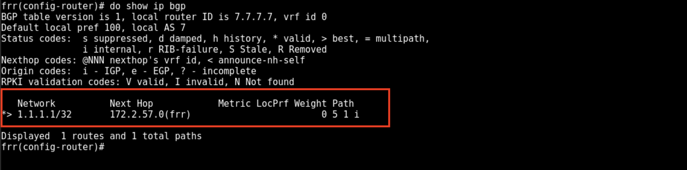
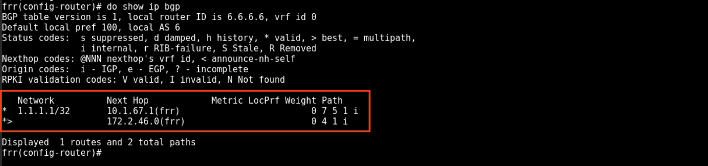

LAB 1
=====

Now that the basics are taken care of, let's peer the rest of the routers.

Terminal
++++++++

Basic terminal commands 

We won't go into detail on these commands, but here are the basic commands you will need to know.

enable

show [command]

configure terminal (config t)

do [command]

Peering
+++++++

Time to start peering the reamining routers, start to distribute routes and test reachability.

Since R1-1 and R2-1 are peered and in the same Autonomous System (AS), we will only need to peer the remaining router R3-1 to R1-1. This too will be an iBGP
peer. Rembering that iBGP needs full mesh or route reflector, in this lab we will use route reflector. 

.. NOTE:: 
   iBGP does not share routes it learns from other iBGP peers. This is a route loop prevention mechanism and why we need full mesh or route reflector.

Let's beging with R3-1 and R1-1 by accessing their web console. On your tab in the command prompt, issue the command

.. code-block:: bash
   :caption: Web Console
   
   frr# config t
   frr(config)#
   
In either router you can issue the command ``do show run`` to see the running configuration. They should match up like the table below.

.. list-table:: 
   :widths: 30 30
   :header-rows: 1

   * - R1-1
     - R3-1

   * - .. code-block::  

          Current configuration:
          !
          frr version 8.2.2
          frr defaults datacenter
          hostname frr
          service integrated-vtysh-config
          !
          interface eth0
           description link to R3-1
           ip address 10.1.13.0/31
          exit 
          interface eth1
           description link to R2-1
           ip address 10.1.12.0/31
          exit 
          interface lo
           description local loopback
           ip address 1.1.1.1/32
          exit
          !
          router bgp 1
           bgp router-id 1.1.1.1
           bgp cluster-id 1.1.1.1
           neighbor 10.1.12.1 remote-as 1
           neighbor 10.1.12.1 peer-group pgroup
           !
           address-family ipv4 unicast
            network 1.1.1.1/32
            neighbor 10.1.12.1 route-reflector-client 
           exit address-family
          exit
          !
          end
     - .. code-block::  

          Current configuration:
          !
          frr version 8.2.2
          frr defaults datacenter
          hostname frr
          service integrated-vtysh-config
          !
          interface eth0
           description link to R1-1
           ip address 10.1.13.1/31
          exit 
          interface eth1
           description link to R1-5
           ip address 10.1.12.0/31
          exit 
          interface lo
           description local loopback
           ip address 1.1.1.3/32
          exit

Let's start with R1-1 and build on the exist BGP configuration.

.. code-block:: bash
   :caption: R1-1 BGP Configuration

   frr# config t
   frr(config)# router bgp 1
   frr(config-router)# neighbor 10.1.13.1 remote-as 1
   frr(config-router)# neighbor 10.1.13.1 peer-group pgroup
   frr(config-router)# address-family ipv4 unicast
   frr(config-router-af)# neighbor 10.1.13.1 route-reflector-client
   frr(config-router-af)# exit
   frr(config-router)# do wr mem
   frr(config-router)# do show run

Now time for R3-1

.. code-block:: bash
   :caption: R3-1 BGP Configuration

   frr# config t
   frr(config)# router bgp 1
   frr(config-router)# neighbor 10.1.13.0 remote-as 1
   frr(config-router)# neighbor 192.168.35.1 remote-as 5
   frr(config-router-af)# exit
   frr(config-router)# do wr mem
   frr(config-router)# do show run

.. code-block:: bash
   :caption: R3-1 bgp summary

   frr(config-router)# do show ip bgp summary

From this output we can see that R3-1 is peered with R1-1 and is *Active* to peer with R1-5 but is not. How do we know we are peered with R1-1?
We can see *MsgRcvd* and *MsgSent* are both greater than 0, our *Up/Down* and *State/PfxRcvd* shows we have received 1 route from R1-1. How do we see what state 
our BGP peer is in? 

.. code-block:: bash
   :caption: R3-1 BGP Neighbors

   frr(config-router)# do show ip bgp neighbors 10.1.13.0

And now we can check for the prefix we received from R1-1 to see what routes we have learned. We will learn a lot in what appears to be a small amount of information.

.. code-block:: bash
   :caption: R3-1 bgp routes

   frr(config-router)# do show ip bgp

The items will focus on are:

- Next-Hop

- Metric

- LocPrf (Local Preference)

- Weight

- Path

| From *Next-Hop* we can see the IP address of the router that advertised the route to us.
| From *Metric* we can see it's 0, we'll come back to this one.
| From *LocPrf* we can see it's 100, meaning this route comes from iBGP. 0 would mean eBGP.
| From *Weight* we can see it's 0, meaning this route is not local to this router. If the route 1.1.1.1 was local to this router, the metric would be 32768.
| And lastly, *Path* shows the routes origin code, in this case it's IGP. (The only other you should see is **?** which means unknown and is shown when the route
comes from redistribution.) These are all parts of the BGP best path selection process.

R1-5 

.. code-block:: bash
   :caption: R1-5 BGP Configuration

   frr# config t
   frr(config)# router bgp 5
   frr(config-router)# neighbor 192.168.35.0 remote-as 1
   frr(config-router)# neighbor 172.2.57.1 remote-as 7
   frr(config-router)# do wr mem
   frr(config-router)# do show run
   frr(config-router)# do show ip bgp summary

Just like before, you should see that you are peered with R3-1 and *Active* to peer with R1-7. You know have an eBGP peer to R3-1. Let's see what that route information
looks like.

.. code-block:: bash
   :caption: R1-5 BGP route

   frr(config-router)# do show ip bgp

Again you can see the *Weight* is 0, meaning this route is not local to this router. Under *Path* you do see the AS Path we learned the router from, in this case 
it's R3-1 from AS 1. You will see in later labs steps, this AS Path will show each AS the route has traversed, leading to best path attributes.

R1-7

.. code-block:: bash
   :caption: R1-7 BGP Configuration

   frr# config t
   frr(config)# router bgp 7
   frr(config-router)# neighbor 172.2.57.0 remote-as 5
   frr(config-router)# neighbor 10.1.67.0 remote-as 6
   frr(config-router)# do wr mem
   frr(config-router)# do show run

.. code-block:: bash
   :caption: R1-7 BGP summary
 
   frr(config-router)# do show ip bgp summary

.. code-block:: bash
   :caption: R1-7 BGP routes
 
   frr(config-router)# do show ip bgp

You should see same info as before, we are peered with R1-5 and *Active* to peer with R1-6. 
Let's check routes, as we should be learning routes from R3-1.

.. code-block:: bash
   :caption: R1-7 routes

   frr(config-router)# do show ip bgp

Notice no the AS Path now shows 5 1, meaning the route to **1.1.1.1** has traversed AS 5 and AS 1. 

R1-6 

.. code-block:: bash
   :caption: R1-6 BGP Configuration

   frr# config t
   frr(config)# router bgp 6
   frr(config-router)# neighbor 10.1.67.1 remote-as 7
   frr(config-router)# do wr mem
   frr(config-router)# do show run

Now we should have completed all BGP peering. Let's check our one route advertised from R1-1.

.. code-block:: bash
   :caption: R1-6 routes

   frr(config-router)# do show ip bgp

Your output should look like this:

