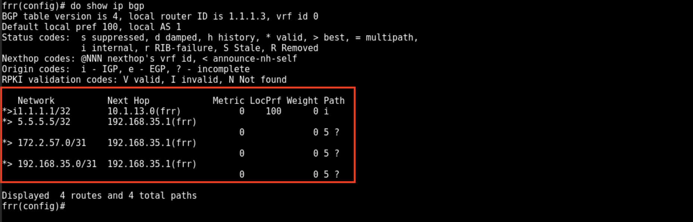
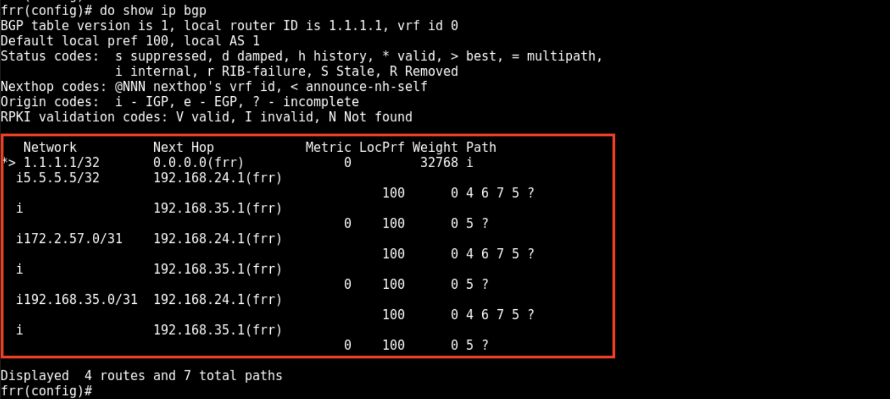
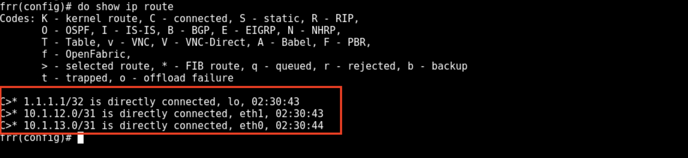
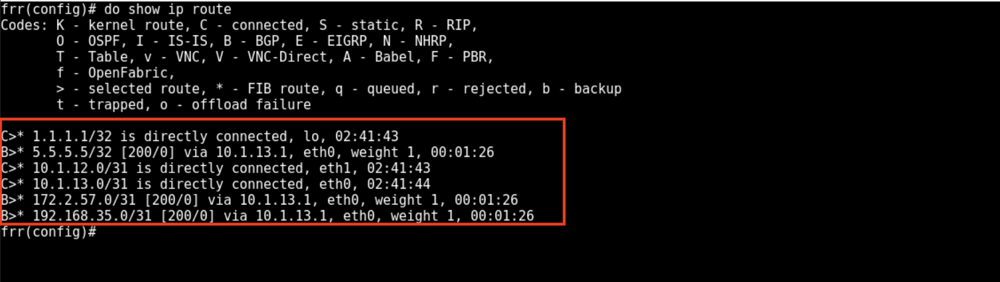

Lab 2
=====

Testing
+++++++

Move to R1-1 to check for reachability to R1-7.

.. code-block:: bash
   :caption: R1-1 ping

   frr(config-router)# do ping 172.2.57.1

Output: Network unreachable

Let's check the routes we have learned.

.. code-block:: bash
   :caption: R1-1 show ip route

   frr(config-router)# do show ip route 

no route to 172.2.57.0 network

Let's jump to R3-1 and check routes. 

.. code-block:: bash
   :caption: R3-1 show ip route

   frr(config-router)# do show ip route

Again we do not see the route to 172.2.57.0 network. This means we are not learning the routes from R1-5. We can also verify this by checking the BGP table.

.. code-block:: bash
   :caption: R3-1 show ip bgp

   frr(config-router)# do show ip bgp 

Let's now move to R1-5 and fix this issue.

.. code-block:: bash
   :caption: R1-5 Redistribute

   frr(config)# router bgp 5
   frr(config-router)# address-family ipv4 unicast
   frr(config-router-af)# redistribute connected
   frr(config-router-af)# exit
   frr(config-router)# do wr mem
   frr(config-router)# do show ip bgp

Now going back to R3-1 and checking BGP table.

.. code-block:: bash
   :caption: R3-1 show ip bgp

   frr(config-router)# do show ip bgp

You now see the routes being learned from R1-5. You can see to the far right the **?** as those routes are learned from redistribution. Now we can work back to 
R1-1 and review the routes we are learning from R3-1.

.. code-block:: bash
   :caption: R1-1 show ip bgp

   frr(config-router)# do show ip bgp

.. code-block:: bash
   :caption: R1-1 show ip bgp

   frr(config-router)# do show ip route

You can see the networks 5.5.5.5, 172.2.57.0 and 192.168.35.0 in the BGP table but not in the routing table. This is because they are not valid (no `*>`), 
notice next hop addess is wrong for R1-1. Those IP's are R1-5 but should be R3-1. 

This is a problem with iBGP, it does not update the next hop address is not modified and it will just pass on the learned next hop. This makes the route invalid
and will not be installed in the routing table.

Let's fix this 

.. code-block:: bash
   :caption: R3-1 BGP Fix

   frr(config-router)# address-family ipv4 unicast
   frr(config-router-af)# neighbor 10.1.13.0 next-hop-self 
   frr(config-router-af)# do wr mem
   frr(config-router-af)# do show run

.. code-block:: bash
   :caption: R2-1 BGP Fix

   frr(config-router)# address-family ipv4 unicast
   frr(config-router-af)# neighbor 10.1.12.0 next-hop-self 
   frr(config-router-af)# do wr mem
   frr(config-router-af)# do show run

Now, we've fixed a lot of issues, time to verify routes at R1-1.

.. code-block:: bash
   :caption: R1-1 show ip route

   frr(config-router)# do show ip route

Now let's test reachability from R1-1 to R1-7.

.. code-block:: bash
   :caption: R1-1 ping

   frr(config-router)# do ping 172.2.57.1
#####################################################